# Challenge: Diseño y Arquitectura de microservicios para un sistema de reservación de habitaciones con Asistencia de Inteligencia Artificial

## Objetivos del Proyecto
Este proyecto final tiene como objetivo aplicar los conocimientos adquiridos en el curso sobre diseño y arquitectura de software, con un enfoque especial en la utilización de herramientas de Inteligencia Artificial (IA) para facilitar y mejorar el proceso de diseño. Los estudiantes utilizarán la IA para generar diagramas cruciales que representen la arquitectura de microservicios para un sistema de reservación de habitaciones, con un enfoque escalable y robusto.

## Descripción del Proyecto
El proyecto consiste en diseñar la arquitectura de un sistema de reservación de habitaciones. Este sistema permite a los usuarios buscar, reservar y gestionar habitaciones en hoteles a través de aplicaciones web y móviles. Los estudiantes deberán considerar aspectos clave como la disponibilidad en tiempo real, la integración con sistemas de pago, la gestión de cancelaciones y modificaciones de reservas, la escalabilidad para manejar picos de demanda, y la seguridad de los datos personales y de las transacciones.

## Tareas a Realizar

### 1. Investigación Preliminar
- Comprender el funcionamiento básico de un sistema de reservación de habitaciones.

<span style="color: orange;">Prompt: ¿Conoces o sabes cómo funciona un sistema de reserva de habitaciones?</span>


Inferencia: ¡Claro! Un sistema de reserva de habitaciones es una aplicación que permite a los usuarios consultar, seleccionar y reservar habitaciones disponibles en un lugar, como un hotel, un hostal o un alojamiento vacacional. A continuación, te detallo los componentes y cómo funciona generalmente:
Componentes Clave

    Interfaz de Usuario (Frontend):
        Muestra las habitaciones disponibles, precios, descripciones e imágenes.
        Ofrece filtros para buscar por fecha, precio, número de personas, etc.
        Formulario para realizar la reserva con los datos del cliente.

    Base de Datos:
        Contiene información sobre las habitaciones (número, tipo, capacidad, estado, precio, etc.).
        Registro de reservas: quién, cuándo, y detalles del pago.
        Registro de usuarios o clientes.

    Lógica del Servidor (Backend):
        Gestiona la disponibilidad de habitaciones según las fechas seleccionadas.
        Procesa las reservas y guarda los datos en la base de datos.
        Maneja la lógica de conflictos (por ejemplo, evitar dobles reservas).

    Sistema de Pago (Opcional):
        Integración con pasarelas de pago (PayPal, Stripe, etc.) para gestionar pagos seguros.

    Notificaciones:
        Correos electrónicos o SMS para confirmar reservas, recordatorios o facturas.

Cómo Funciona

    Consulta de Disponibilidad:
        El usuario introduce fechas de entrada y salida, junto con detalles (número de personas, tipo de habitación).
        El sistema consulta la base de datos para encontrar habitaciones disponibles que coincidan con los criterios.

    Selección de Habitación:
        Se presentan las opciones al usuario.
        El usuario selecciona la habitación deseada y procede con la reserva.

    Proceso de Reserva:
        El usuario introduce sus datos (nombre, contacto, etc.).
        Si el sistema está integrado con un procesador de pagos, se realiza el pago en este paso.

    Confirmación:
        Una vez confirmada la reserva (y el pago si aplica), el sistema actualiza el estado de la habitación a "reservada" para las fechas seleccionadas.
        Se envía una notificación al cliente con los detalles de la reserva.

    Gestión de Reservas:
        El administrador del sistema puede modificar, cancelar o revisar reservas a través de un panel de control.

Retos Comunes

    Evitar dobles reservas: Implementar bloqueos temporales mientras el cliente completa el proceso.
    Sincronización en tiempo real: Si el sistema está integrado con otras plataformas (como Booking.com o Airbnb).
    Seguridad: Proteger los datos de los usuarios y transacciones con cifrado.

¿Planeas implementar algo similar o tienes dudas específicas sobre alguna parte del proceso? 😊

<span style="color: orange;">Prompt: Necesito profundizar el sistema de reservas. Enfocado en las características que debe poseer un sistema de reserva de habitaciones con una arquitectura de microservicios y cuyo enfoque principal es ser escalable y robusto. ¿Podrías reformular tu respuesta anterior considerando estos aspectos claves del sistema?</span>

Inferencia: ¡Claro! Si el objetivo es diseñar un **sistema de reserva de habitaciones** con una **arquitectura de microservicios**, orientado a la **escalabilidad** y **robustez**, es importante abordar las características desde la perspectiva de una arquitectura distribuida. Aquí tienes una reformulación más técnica y enfocada:

---

### **Componentes Clave en una Arquitectura de Microservicios**

#### **1. Microservicios Principales**
1. **Servicio de Gestión de Habitaciones**:
   - Almacena y administra los datos de las habitaciones (número, tipo, capacidad, estado, precio).
   - Expone API para consultar disponibilidad, actualizar el estado y modificar detalles de las habitaciones.

2. **Servicio de Reservas**:
   - Maneja el flujo de reservas: verificar disponibilidad, bloquear habitaciones temporalmente, confirmar o cancelar reservas.
   - Implementa lógica para manejar conflictos de concurrencia, garantizando que no se produzcan dobles reservas.

3. **Servicio de Usuarios y Clientes**:
   - Gestiona el registro, autenticación y perfiles de usuarios (clientes y administradores).
   - Ofrece integración con sistemas de identidad (OAuth, SSO).

4. **Servicio de Pagos**:
   - Procesa pagos seguros mediante integraciones con pasarelas de pago (Stripe, PayPal, etc.).
   - Implementa lógica de reembolsos y manejo de errores transaccionales.

5. **Servicio de Notificaciones**:
   - Envía confirmaciones de reserva, recordatorios o alertas a través de correo electrónico, SMS o notificaciones push.

6. **Servicio de Disponibilidad en Tiempo Real**:
   - Actualiza y sincroniza el estado de las habitaciones en tiempo real, especialmente si el sistema se conecta a plataformas externas (como Booking.com, Airbnb, etc.).

7. **Servicio de Reportes y Analíticas**:
   - Genera reportes sobre ocupación, ingresos, cancelaciones y estadísticas clave para el negocio.
   - Proporciona analíticas en tiempo real para la toma de decisiones.

---

### **Características Clave para Escalabilidad y Robustez**

#### **1. Escalabilidad**
- **Desacoplamiento entre Servicios**:
  - Cada servicio es independiente y puede ser escalado horizontalmente según la carga (por ejemplo, el servicio de pagos durante la temporada alta).
  
- **Mensajería Asíncrona**:
  - Utilizar un **Message Broker** (como RabbitMQ o Kafka) para la comunicación entre servicios. Esto desacopla los servicios y mejora la resiliencia ante altas cargas.

- **Caché Distribuida**:
  - Implementar un sistema como Redis o Memcached para almacenar resultados frecuentes, como disponibilidad de habitaciones para búsquedas rápidas.

- **Uso de Bases de Datos Distribuidas**:
  - Bases de datos como **Cassandra**, **CockroachDB**, o **PostgreSQL** con replicación y particionado para manejar grandes volúmenes de datos de manera eficiente.

#### **2. Robustez**
- **Tolerancia a Fallos**:
  - Cada microservicio debe manejar errores localmente y usar patrones como **Circuit Breaker** (con herramientas como Resilience4j) para evitar cascadas de fallos.

- **Transacciones Distribuidas**:
  - Implementar patrones como **Sagas** para manejar transacciones distribuidas entre servicios (por ejemplo, confirmar reserva y procesar el pago).

- **Balanceo de Carga**:
  - Usar herramientas como NGINX o un servicio de balanceo en la nube para distribuir el tráfico de manera uniforme.

- **Monitorización y Observabilidad**:
  - Integrar herramientas como Prometheus, Grafana y ELK Stack (Elasticsearch, Logstash, Kibana) para monitorear métricas, logs y detectar problemas.

- **Backup y Recuperación**:
  - Automatizar respaldos periódicos y asegurar planes de recuperación ante desastres.

---

### **Flujo de Trabajo en un Sistema Distribuido**

1. **Consulta de Disponibilidad**:
   - El cliente envía una solicitud al **API Gateway**, que redirige la consulta al **Servicio de Disponibilidad**.
   - Este servicio consulta el estado de las habitaciones desde la base de datos (o la caché si aplica).

2. **Selección de Habitación y Reserva**:
   - El cliente selecciona una habitación y confirma las fechas.
   - El **Servicio de Reservas** inicia una transacción distribuida para bloquear temporalmente la habitación y envía un evento al **Servicio de Pagos**.

3. **Confirmación de Pago**:
   - El **Servicio de Pagos** procesa la transacción y notifica al **Servicio de Reservas** sobre el éxito o fallo.
   - Si tiene éxito, el estado de la habitación se actualiza a "reservada" y el cliente recibe una confirmación mediante el **Servicio de Notificaciones**.

4. **Sincronización con Plataformas Externas** (si aplica):
   - El **Servicio de Integración de Canales** actualiza automáticamente el estado en plataformas externas.

---

### **Ventajas de Esta Arquitectura**

1. **Escalabilidad**:
   - Cada servicio puede escalarse de manera independiente según las necesidades.
   
2. **Mantenimiento Simplificado**:
   - Cambios en un servicio no afectan a los demás, siempre que las interfaces estén bien definidas.

3. **Alta Disponibilidad**:
   - Fallos en un microservicio no colapsan el sistema completo, especialmente con patrones de tolerancia a fallos.

4. **Flexibilidad**:
   - Se pueden agregar nuevas funcionalidades (como descuentos o paquetes promocionales) sin reestructurar todo el sistema.

---

Si tienes un caso de uso más específico o necesitas ejemplos prácticos de implementación (como usar Spring Boot, Node.js o cualquier otra tecnología), ¡puedo ayudarte a detallar más! 😊


- Identificar los principales componentes y actores involucrados en el sistema.

<span style="color: orange;">
Prompt: Los componentes que identificaste están perfectos. Profundiza, por favor, en la descripción de los actores involucrados o que intervendrían en el sistema.
</span>

Inferencia: ¡Claro! En un sistema de reservas de habitaciones con enfoque en microservicios, los actores representan tanto a los usuarios finales como a las entidades internas o externas que interactúan con el sistema. Aquí tienes una descripción detallada de cada tipo de actor y su papel:

---

### **Actores Involucrados en el Sistema**

#### **1. Usuarios Finales**
1. **Clientes**
   - **Descripción**: Personas que buscan reservar habitaciones para estadías.
   - **Interacciones**:
     - Consultan disponibilidad de habitaciones.
     - Seleccionan fechas y realizan reservas.
     - Realizan pagos en línea o seleccionan métodos alternativos.
     - Reciben notificaciones de confirmación o recordatorios.
   - **Requerimientos Técnicos**:
     - Experiencia de usuario fluida y accesible desde múltiples dispositivos.
     - Capacidad para manejar alta concurrencia durante temporadas altas.

2. **Administradores del Alojamiento**
   - **Descripción**: Personal del alojamiento encargado de gestionar reservas, disponibilidad y precios.
   - **Interacciones**:
     - Acceden a un panel para visualizar el estado de las reservas y habitaciones.
     - Modifican la disponibilidad manualmente (por mantenimiento, eventos especiales, etc.).
     - Gestionan tarifas y promociones.
     - Generan reportes de ocupación y rendimiento.
   - **Requerimientos Técnicos**:
     - Panel de administración con estadísticas en tiempo real.
     - Capacidad para actualizar múltiples habitaciones y fechas simultáneamente.

#### **2. Entidades Internas del Sistema**
1. **Microservicio de Reservas**
   - **Rol**: Procesa las solicitudes de reserva y asegura la consistencia del estado de las habitaciones.
   - **Interacciones**:
     - Coordina entre los servicios de disponibilidad y pagos.
     - Maneja bloqueos temporales para evitar dobles reservas.
     - Genera eventos para los servicios de notificaciones y reportes.

2. **Microservicio de Pagos**
   - **Rol**: Garantiza el procesamiento seguro de transacciones.
   - **Interacciones**:
     - Se comunica con pasarelas de pago externas para validar transacciones.
     - Notifica el éxito o fallo de los pagos al servicio de reservas.
     - Maneja reembolsos y disputas.
   
3. **Microservicio de Disponibilidad**
   - **Rol**: Centraliza el estado de las habitaciones y asegura respuestas rápidas a consultas de disponibilidad.
   - **Interacciones**:
     - Actualiza el estado en tiempo real según las reservas confirmadas.
     - Maneja sincronización con plataformas externas (Booking, Airbnb, etc.).
     - Trabaja en conjunto con sistemas de caché para optimizar el rendimiento.

4. **Microservicio de Notificaciones**
   - **Rol**: Automatiza la comunicación con los clientes.
   - **Interacciones**:
     - Envía correos electrónicos o mensajes SMS para confirmar reservas.
     - Envía recordatorios antes del check-in y encuestas después del check-out.
     - Notifica sobre cancelaciones o cambios de última hora.

5. **Microservicio de Reportes y Analíticas**
   - **Rol**: Proporciona información clave para la toma de decisiones.
   - **Interacciones**:
     - Recoge datos de transacciones, ocupación y actividad del sistema.
     - Genera reportes automatizados para administradores.

#### **3. Actores Externos**
1. **Pasarelas de Pago**
   - **Descripción**: Servicios externos que procesan pagos electrónicos.
   - **Interacciones**:
     - Validan tarjetas de crédito/débito o métodos alternativos como PayPal.
     - Devuelven el estado de la transacción (éxito, fallo, fraude detectado).
   - **Requerimientos Técnicos**:
     - APIs robustas y seguras.
     - Soporte para múltiples monedas y métodos de pago.

2. **Plataformas de Terceros**
   - **Descripción**: Agencias de viajes en línea (OTA) como Booking.com, Expedia o Airbnb.
   - **Interacciones**:
     - Sincronizan la disponibilidad de habitaciones con el sistema interno.
     - Reciben confirmaciones de reservas para su procesamiento.
   - **Requerimientos Técnicos**:
     - Integraciones API para mantener la sincronización bidireccional en tiempo real.
     - Mecanismos de reconciliación para evitar conflictos.

3. **Proveedores de Notificaciones**
   - **Descripción**: Servicios externos como Twilio, SendGrid o Firebase.
   - **Interacciones**:
     - Envían mensajes a clientes finales según eventos generados por el sistema.
     - Proveen métricas de entrega y estado de los mensajes.
   - **Requerimientos Técnicos**:
     - Alta disponibilidad para garantizar la entrega de notificaciones críticas.

---

### **Interacción Entre los Actores**

#### **Escenario Típico: Reserva**
1. El **Cliente** consulta disponibilidad.
   - La solicitud se dirige al **Microservicio de Disponibilidad**.
   - Este responde con las habitaciones disponibles desde la base de datos o la caché.

2. El cliente selecciona una habitación y confirma la reserva.
   - El **Microservicio de Reservas** bloquea temporalmente la habitación.
   - Envía una solicitud al **Microservicio de Pagos** para procesar el pago.

3. Si el pago es exitoso:
   - El estado de la habitación se actualiza a "reservada".
   - Se genera un evento para el **Microservicio de Notificaciones**, que envía una confirmación.

4. Si el cliente utilizó una **Plataforma de Terceros**:
   - El **Servicio de Disponibilidad** sincroniza la reserva con dicha plataforma.

---

### **Resumen de Roles y Responsabilidades**

| Actor                        | Rol Principal                                          | Interacción                    |
|------------------------------|-------------------------------------------------------|--------------------------------|
| **Cliente**                  | Realiza reservas y pagos                              | Frontend/API Gateway           |
| **Administrador**            | Gestiona disponibilidad, tarifas y reportes          | Panel de administración        |
| **Microservicio de Reservas**| Coordina reservas y transacciones                    | Base de datos, servicios internos |
| **Pasarela de Pagos**        | Procesa transacciones financieras                    | API externa                    |
| **Proveedor de Notificaciones** | Envía mensajes y confirmaciones                     | Servicio externo               |
| **Plataformas Externas**     | Sincronizan disponibilidad y reservas                | APIs externas                  |

---

¿Tienes en mente algún actor adicional o algún caso de uso particular que quieras desarrollar más? 😊


### 2. Generación de Diagramas con IA
Los estudiantes utilizarán herramientas de IA para generar los siguientes diagramas, específicos para el diseño de un sistema de reservación de habitaciones:

<span style="color: orange;">
Prompt: Con todo el contexto que hemos generado para el sistema de reservas, estás en condiciones de generar algunos diagramas en formato mermaid? No los generes aún, solo confirma si necesitas más información o si te gustaría recibir más contexto.
</span>

Inferencia: Sí, puedo generar diagramas en formato **Mermaid** con el contexto que ya hemos desarrollado. Estos diagramas pueden incluir:

1. **Diagrama de componentes** para mostrar los microservicios y sus interacciones.
2. **Diagrama de flujo** para describir el proceso de reserva desde la consulta hasta la confirmación.
3. **Diagrama de casos de uso** para ilustrar las interacciones entre los actores (clientes, administradores, servicios externos, etc.).
4. **Diagrama de secuencia** para detallar el flujo entre los servicios durante una operación específica, como una reserva o pago.

Si tienes algún escenario o componente específico que quieras priorizar en los diagramas, o si deseas agregar más detalles técnicos (como herramientas específicas, endpoints API, etc.), házmelo saber antes de comenzar. 😊

- **a. Diagrama de Arquitectura de Software en Mermaid:** Crea un diagrama que visualice los componentes principales del sistema de reservación de habitaciones y cómo interactúan entre sí. Este debe incluir servicios como el motor de búsqueda, gestión de reservas, procesamiento de pagos, notificaciones, y administración de disponibilidad en tiempo real.

<span style="color: orange;">
Prompt: Necesito un diagrama de arquitectura de software, en formato mermaid, donde se pueda visualizar claramente la interacción entre los diferentes componentes del sistema que fueron individualizados anteriormente. El diagrama debe ser lo más claro posible, pero sin descuidar detalles de la interacción entre los componente. 
</span>

Inferencia: Aquí tienes el **diagrama de arquitectura de software** en formato **Mermaid**, diseñado para mostrar las interacciones entre los microservicios, los actores principales y los servicios externos. El foco está en reflejar claramente cómo se comunican los componentes y el flujo entre ellos:

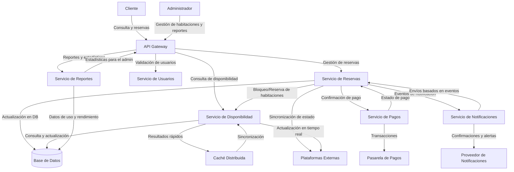

---

### **Descripción del Diagrama**
1. **Actores principales**: El cliente y el administrador interactúan con el sistema a través del **API Gateway**.
2. **Microservicios principales**:
   - **Servicio de Reservas** gestiona el flujo central: bloqueo de habitaciones, pagos y notificaciones.
   - **Servicio de Disponibilidad** se conecta a la base de datos y utiliza una **caché distribuida** para mejorar el rendimiento.
   - **Servicio de Usuarios** valida a los usuarios finales (clientes y administradores).
   - **Servicio de Pagos** gestiona la interacción con la pasarela de pagos.
   - **Servicio de Notificaciones** maneja el envío de correos y alertas, dependiendo de eventos generados.
   - **Servicio de Reportes** genera estadísticas y reportes basados en datos almacenados.
3. **Servicios externos**:
   - **Pasarelas de Pago** procesan transacciones.
   - **Proveedores de Notificaciones** entregan mensajes al cliente.
   - **Plataformas Externas** sincronizan disponibilidad y reservas en tiempo real.

---

Si necesitas algún ajuste, como detalles más específicos en algún flujo o un énfasis en un componente particular, puedo adaptarlo. 😊

<span style="color: orange;">
Prompt: Necesito un texto explicativo que sirva como introducción de lo que se visualiza en el diagrama. Una breve explicación del mismo. 
</span>

Inferencia: 

### **Introducción al Diagrama de Arquitectura del Sistema de Reservas**

El diagrama representa la arquitectura del sistema de reservas de habitaciones, diseñado bajo una arquitectura de **microservicios** para garantizar **escalabilidad**, **robustez** y **modularidad**. Cada componente cumple un rol específico y se comunica de manera controlada, promoviendo la independencia y la reutilización de servicios.

---

### **Descripción General**

1. **Interacción con los Actores**:
   - Los **clientes** y **administradores** interactúan con el sistema a través de un **API Gateway**, que centraliza las solicitudes y las distribuye hacia los microservicios correspondientes.
   - Los clientes realizan consultas de disponibilidad, reservas y pagos, mientras que los administradores gestionan habitaciones, precios y reportes.

2. **Componentes Internos del Sistema**:
   - **Servicio de Reservas**: Es el núcleo del sistema, gestionando las reservas desde el bloqueo temporal de habitaciones hasta la confirmación, coordinando con los servicios de pagos y notificaciones.
   - **Servicio de Disponibilidad**: Responde consultas sobre el estado de las habitaciones, optimizando el rendimiento mediante una caché distribuida y sincronizando cambios con la base de datos.
   - **Servicio de Pagos**: Procesa transacciones de manera segura integrándose con pasarelas de pago externas.
   - **Servicio de Notificaciones**: Gestiona la comunicación con los clientes y administradores mediante proveedores externos para correos y mensajes.
   - **Servicio de Reportes**: Consolida datos sobre reservas, ocupación y rendimiento para generar estadísticas y reportes útiles para la administración.

3. **Servicios Externos**:
   - La arquitectura interactúa con **pasarelas de pago**, **proveedores de notificaciones**, y **plataformas de terceros** (como Booking.com o Airbnb) para sincronizar disponibilidad y reservas.

4. **Base de Datos y Caché**:
   - La base de datos central almacena información estructurada sobre habitaciones, usuarios y reservas, mientras que una **caché distribuida** acelera las respuestas a consultas frecuentes.

---

Este diseño modular asegura que cada microservicio pueda ser escalado y mantenido de forma independiente, permitiendo una respuesta eficiente a altas demandas y una alta disponibilidad del sistema.

<span style="color: orange;">
Prompt: Ahora utilizaré algunas 'plantillas' para indicarte el diagrama que necesito, para que lo generes basado en el contexto que hemos venido trabajando, estás listo?
</span>

Inferencia: ¡Por supuesto! Estoy listo para recibir las plantillas o instrucciones y generar el diagrama correspondiente en Mermaid, adaptado al contexto que hemos trabajado. Adelante con los detalles. 😊


- **b. Diagrama UML de Componentes:** Desarrolla un diagrama UML que muestre los componentes del sistema de reservación de habitaciones y sus relaciones, destacando la comunicación entre módulos como el sistema de autenticación de usuarios, el servicio de inventario de habitaciones, y la integración con sistemas externos como procesadores de pago y canales de notificación.

<span style="color: orange;">
Prompt: Descripción del comportamiento a modelar: Ilustrar los componentes del sistema de reservación de habitaciones y sus relaciones, destacando la comunicación entre módulos como el sistema de autenticación de usuarios, el servicio de inventario de habitaciones, y la integración con sistemas externos como procesadores de pago y canales de notificación.
Diagrama deseado: Diagrama UML de Componentes
Restricciones: Formato diagrama UML
</span>

¡Entendido! Aquí tienes el Diagrama UML de Componentes en formato Mermaid, modelando el comportamiento descrito:

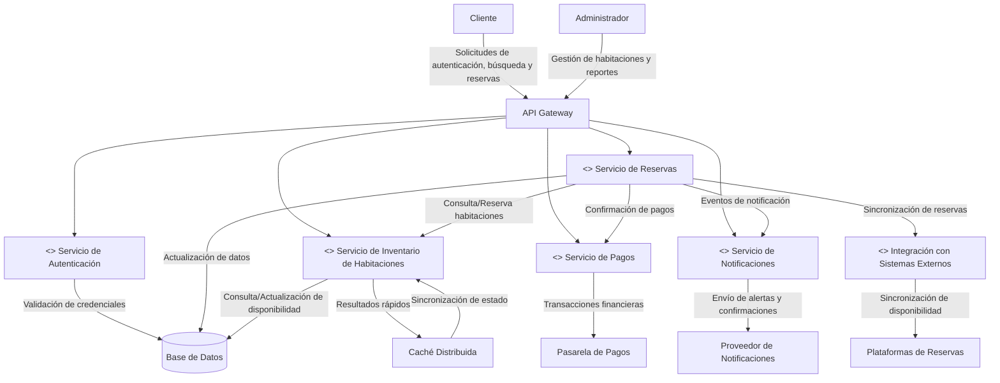

---

### **Explicación del Diagrama**
1. **Actores Principales**:
   - **Cliente** y **Administrador** interactúan con el sistema a través del **API Gateway**, que actúa como un punto de entrada centralizado.
   
2. **Componentes Internos**:
   - **Servicio de Autenticación**: Valida las credenciales de los usuarios consultando la base de datos.
   - **Servicio de Reservas**: Maneja el flujo principal de reservas, coordinando con el servicio de inventario, pagos y notificaciones.
   - **Servicio de Inventario**: Gestiona la disponibilidad de habitaciones y utiliza una **caché distribuida** para respuestas rápidas.
   - **Servicio de Pagos**: Procesa transacciones financieras mediante una integración con pasarelas de pago externas.
   - **Servicio de Notificaciones**: Envía confirmaciones, recordatorios o alertas mediante proveedores de servicios externos.
   - **Integración con Sistemas Externos**: Sincroniza disponibilidad y reservas con plataformas externas como Booking.com o Airbnb.

3. **Base de Datos y Caché**:
   - La base de datos almacena información estructurada, mientras que la caché optimiza la consulta de datos frecuentes (como la disponibilidad de habitaciones).

4. **Servicios Externos**:
   - La arquitectura interactúa con **pasarelas de pago**, **proveedores de notificaciones** y **plataformas externas**, asegurando la integración y sincronización en tiempo real.

Este diagrama captura la comunicación y relaciones entre los módulos internos y externos, destacando su interoperabilidad y modularidad. ¿Te gustaría algún ajuste o agregar más detalles? 😊

<span style="color: orange;">
Prompt: Podrías corregir el diagrama anterior creando un diagrama de tipo UML (no mermaid) que represente la arquitectura del sistema de reserva de habitaciones y las diferentes capas de aplicación que deben existir. 
</span>

Inferencia: Crearé un diagrama UML que represente la arquitectura del sistema de reservas de habitaciones, organizando los componentes en **capas de aplicación**. Este diagrama incluirá las capas típicas de una arquitectura bien estructurada, como presentación, lógica de negocio, integración y persistencia, además de las interacciones clave entre ellas. Aquí está el diagrama en descripción textual (puedes convertirlo a un dibujo en una herramienta de diagramación):

---

### **Diagrama UML: Arquitectura por Capas**

```plaintext
+---------------------------------------------------------------+
|                        Capa de Presentación                  |
|---------------------------------------------------------------|
| - Interfaz de Usuario (Cliente Web, App Móvil)               |
| - API Gateway                                                |
+---------------------------------------------------------------+
                         |
                         V
+---------------------------------------------------------------+
|                     Capa de Lógica de Negocio                |
|---------------------------------------------------------------|
| - Servicio de Autenticación                                  |
| - Servicio de Reservas                                       |
| - Servicio de Inventario de Habitaciones                    |
| - Servicio de Pagos                                          |
| - Servicio de Notificaciones                                 |
| - Servicio de Reportes                                       |
+---------------------------------------------------------------+
                         |
                         V
+---------------------------------------------------------------+
|                  Capa de Integración                         |
|---------------------------------------------------------------|
| - Integración con Pasarela de Pagos                          |
| - Integración con Proveedores de Notificaciones              |
| - Integración con Plataformas Externas (Booking, Airbnb)     |
+---------------------------------------------------------------+
                         |
                         V
+---------------------------------------------------------------+
|                   Capa de Persistencia                       |
|---------------------------------------------------------------|
| - Base de Datos (Usuarios, Habitaciones, Reservas)           |
| - Caché Distribuida (Disponibilidad, Datos Temporales)       |
+---------------------------------------------------------------+
```

---

### **Explicación del Diagrama**

#### **1. Capa de Presentación**
- Proporciona la interfaz que utilizan los actores para interactuar con el sistema.
- Incluye el **API Gateway**, que actúa como intermediario entre los clientes y los microservicios.

#### **2. Capa de Lógica de Negocio**
- Contiene los microservicios que implementan la lógica principal del sistema:
  - **Autenticación**: Valida usuarios y sesiones.
  - **Reservas**: Gestiona el proceso completo de reserva, integrándose con el inventario y pagos.
  - **Inventario**: Consulta y actualiza la disponibilidad de habitaciones.
  - **Pagos**: Procesa transacciones y coordina con pasarelas externas.
  - **Notificaciones**: Envía confirmaciones, recordatorios o alertas.
  - **Reportes**: Consolida datos y genera estadísticas para administradores.

#### **3. Capa de Integración**
- Se encarga de conectar los microservicios internos con servicios y sistemas externos:
  - **Pasarela de Pagos**: Procesa transacciones de forma segura.
  - **Proveedores de Notificaciones**: Gestionan el envío de correos, SMS o notificaciones push.
  - **Plataformas Externas**: Sincronizan inventario y reservas con sistemas como Booking.com.

#### **4. Capa de Persistencia**
- Gestiona el almacenamiento de datos:
  - **Base de Datos**: Almacena información estructurada de usuarios, habitaciones y reservas.
  - **Caché Distribuida**: Mejora el rendimiento almacenando datos frecuentemente consultados.

---

Este esquema presenta la arquitectura por capas y sugiere cómo organizar los componentes del sistema. Si necesitas un dibujo en herramientas UML, puedo guiarte con herramientas como Lucidchart, Visual Paradigm o Diagrams.net para hacerlo. 😊

<span style="color: orange;">
Prompt: ¿puedes generar el Diagrama UML: Arquitectura por Capas para Diagrams.net?
</span>

Inferencia: Puedo generarte el contenido en formato XML para que lo utilices directamente en **Diagrams.net** (anteriormente conocido como Draw.io). Este diagrama reflejará la arquitectura por capas descrita, y lo puedes importar fácilmente. Aquí está el código XML:

```xml
<?xml version="1.0" encoding="UTF-8"?>
<mxfile host="app.diagrams.net">
  <diagram name="Arquitectura por Capas">
    <mxGraphModel dx="1040" dy="642" grid="1" gridSize="10" guides="1" tooltips="1" connect="1" arrows="1" fold="1" page="1" pageScale="1" pageWidth="827" pageHeight="1169" math="0" shadow="0">
      <root>
        <mxCell id="0" />
        <mxCell id="1" parent="0" />
        
        <!-- Capa de Presentación -->
        <mxCell id="presentationLayer" value="Capa de Presentación" style="rounded=1;whiteSpace=wrap;html=1;fillColor=#D5E8D4;strokeColor=#82B366;" vertex="1" parent="1">
          <mxGeometry x="20" y="20" width="720" height="80" as="geometry" />
        </mxCell>
        <mxCell id="uiComponent" value="Interfaz de Usuario (Cliente Web, App Móvil)" style="rounded=0;whiteSpace=wrap;html=1;strokeColor=#6C8EBF;" vertex="1" parent="presentationLayer">
          <mxGeometry x="10" y="10" width="700" height="30" as="geometry" />
        </mxCell>
        <mxCell id="apiGateway" value="API Gateway" style="rounded=0;whiteSpace=wrap;html=1;strokeColor=#6C8EBF;" vertex="1" parent="presentationLayer">
          <mxGeometry x="10" y="50" width="700" height="30" as="geometry" />
        </mxCell>
        
        <!-- Capa de Lógica de Negocio -->
        <mxCell id="businessLayer" value="Capa de Lógica de Negocio" style="rounded=1;whiteSpace=wrap;html=1;fillColor=#FFF2CC;strokeColor=#D6B656;" vertex="1" parent="1">
          <mxGeometry x="20" y="120" width="720" height="180" as="geometry" />
        </mxCell>
        <mxCell id="authService" value="Servicio de Autenticación" style="rounded=0;whiteSpace=wrap;html=1;strokeColor=#D6B656;" vertex="1" parent="businessLayer">
          <mxGeometry x="10" y="10" width="700" height="30" as="geometry" />
        </mxCell>
        <mxCell id="reservationsService" value="Servicio de Reservas" style="rounded=0;whiteSpace=wrap;html=1;strokeColor=#D6B656;" vertex="1" parent="businessLayer">
          <mxGeometry x="10" y="50" width="700" height="30" as="geometry" />
        </mxCell>
        <mxCell id="inventoryService" value="Servicio de Inventario de Habitaciones" style="rounded=0;whiteSpace=wrap;html=1;strokeColor=#D6B656;" vertex="1" parent="businessLayer">
          <mxGeometry x="10" y="90" width="700" height="30" as="geometry" />
        </mxCell>
        <mxCell id="paymentsService" value="Servicio de Pagos" style="rounded=0;whiteSpace=wrap;html=1;strokeColor=#D6B656;" vertex="1" parent="businessLayer">
          <mxGeometry x="10" y="130" width="700" height="30" as="geometry" />
        </mxCell>
        <mxCell id="notificationsService" value="Servicio de Notificaciones" style="rounded=0;whiteSpace=wrap;html=1;strokeColor=#D6B656;" vertex="1" parent="businessLayer">
          <mxGeometry x="10" y="170" width="700" height="30" as="geometry" />
        </mxCell>
        
        <!-- Capa de Integración -->
        <mxCell id="integrationLayer" value="Capa de Integración" style="rounded=1;whiteSpace=wrap;html=1;fillColor=#F8CECC;strokeColor=#B85450;" vertex="1" parent="1">
          <mxGeometry x="20" y="320" width="720" height="120" as="geometry" />
        </mxCell>
        <mxCell id="paymentGateway" value="Integración con Pasarela de Pagos" style="rounded=0;whiteSpace=wrap;html=1;strokeColor=#B85450;" vertex="1" parent="integrationLayer">
          <mxGeometry x="10" y="10" width="700" height="30" as="geometry" />
        </mxCell>
        <mxCell id="notificationProvider" value="Integración con Proveedores de Notificaciones" style="rounded=0;whiteSpace=wrap;html=1;strokeColor=#B85450;" vertex="1" parent="integrationLayer">
          <mxGeometry x="10" y="50" width="700" height="30" as="geometry" />
        </mxCell>
        <mxCell id="externalPlatforms" value="Integración con Plataformas Externas (Booking, Airbnb)" style="rounded=0;whiteSpace=wrap;html=1;strokeColor=#B85450;" vertex="1" parent="integrationLayer">
          <mxGeometry x="10" y="90" width="700" height="30" as="geometry" />
        </mxCell>
        
        <!-- Capa de Persistencia -->
        <mxCell id="persistenceLayer" value="Capa de Persistencia" style="rounded=1;whiteSpace=wrap;html=1;fillColor=#DAE8FC;strokeColor=#6C8EBF;" vertex="1" parent="1">
          <mxGeometry x="20" y="460" width="720" height="80" as="geometry" />
        </mxCell>
        <mxCell id="database" value="Base de Datos (Usuarios, Habitaciones, Reservas)" style="rounded=0;whiteSpace=wrap;html=1;strokeColor=#6C8EBF;" vertex="1" parent="persistenceLayer">
          <mxGeometry x="10" y="10" width="700" height="30" as="geometry" />
        </mxCell>
        <mxCell id="cache" value="Caché Distribuida (Disponibilidad, Datos Temporales)" style="rounded=0;whiteSpace=wrap;html=1;strokeColor=#6C8EBF;" vertex="1" parent="persistenceLayer">
          <mxGeometry x="10" y="50" width="700" height="30" as="geometry" />
        </mxCell>
      </root>
    </mxGraphModel>
  </diagram>
</mxfile>
```

---

### **Cómo usar este código**:
1. Abre [Diagrams.net (Draw.io)](https://app.diagrams.net/).
2. Ve a **Archivo > Importar desde > Archivo de dispositivo**.
3. Copia este código en un archivo `.drawio` o `.xml` y cárgalo en la herramienta.

Esto te generará el diagrama con las capas de arquitectura organizadas, con colores y estilo limpio para personalizar si es necesario. 😊

<span style="color: orange;">Prompt: ¿puedes generar el Diagrama UML: Arquitectura por Capas? Ejemplo del lenguaje:</span>


@startuml
[First component]
[Another component] as Comp2
component Comp3
component [Last\ncomponent] as Comp4
@enduml


Inferencia: Aquí tienes el **Diagrama UML de Arquitectura por Capas** generado en el lenguaje de PlantUML:

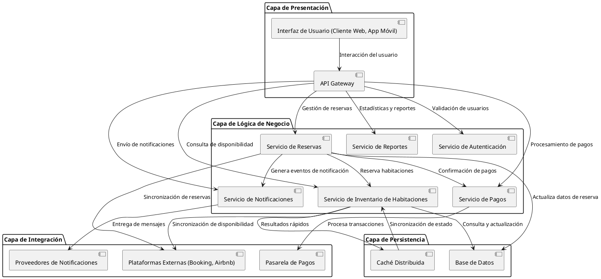

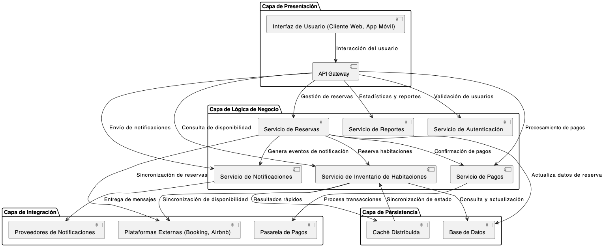

---

### **Cómo usarlo**
1. Copia este código en un editor compatible con PlantUML (por ejemplo, [PlantText](https://planttext.com/) o [Diagrams.net con PlantUML](https://www.diagrams.net/)).
2. Genera el diagrama para visualizar las interacciones entre las capas.

¿Te gustaría añadir más detalles o ajustar algo? 😊


<span style="color: orange;">Prompt: puedes recuperar el contexto del sistema de reservas del que veníamos hablando anteriormente? Si la respuesta es si, podría entregarte instrucciones para generar diferentes tipos de digramas?</span>


Inferencia: ¡Sí, puedo recuperar el contexto del sistema de reservas sobre el que hemos estado trabajando! Recuerdo que hemos hablado de una arquitectura basada en microservicios, con componentes como autenticación, inventario, reservas, pagos, notificaciones, reportes, integración con servicios externos y una estructura por capas.

Estoy listo para recibir tus instrucciones y generar diferentes tipos de diagramas basados en este contexto, como diagramas de componentes, clases, secuencias, despliegue, entre otros. 😊


- **c. Diagrama de Secuencia UML:** Genera un diagrama de secuencia UML que detalle el flujo de interacciones en el sistema durante el proceso de reservación de una habitación. Este debe incluir la búsqueda de disponibilidad, selección de habitación, confirmación de la reserva, y el procesamiento del pago.

<span style="color: orange;">Prompt: necesito generar un diagrama de secuencias que detalle el flujo de interacciones en el sistema durante el proceso de reservación de una habitación. Este debe incluir la búsqueda de disponibilidad, selección de habitación, confirmación de la reserva, y el procesamiento del pago.</span>


ejemplo del resultado esperado:

@startuml
Alice -> Bob: Authentication Request
Bob --> Alice: Authentication Response

Alice -> Bob: Another authentication Request
Alice <-- Bob: another authentication Response
@enduml


Inferencia: 

Aquí tienes un diagrama de secuencias para el proceso de reservación de una habitación, desde la búsqueda de disponibilidad hasta el procesamiento del pago, en formato PlantUML:

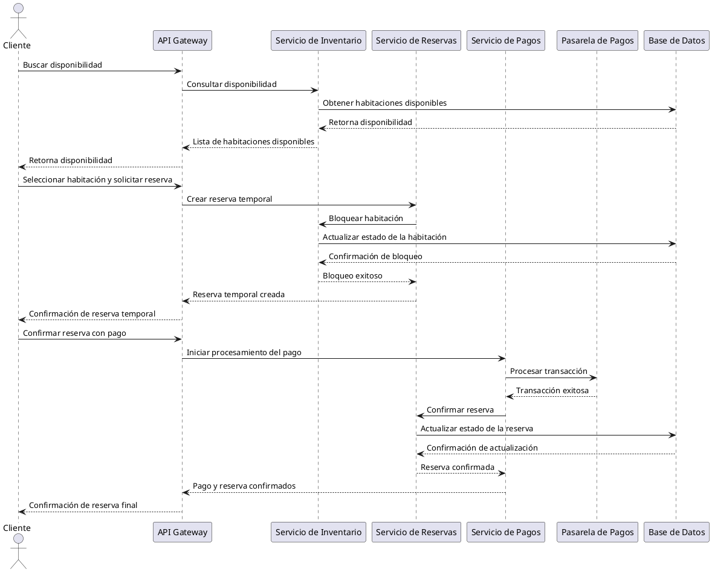

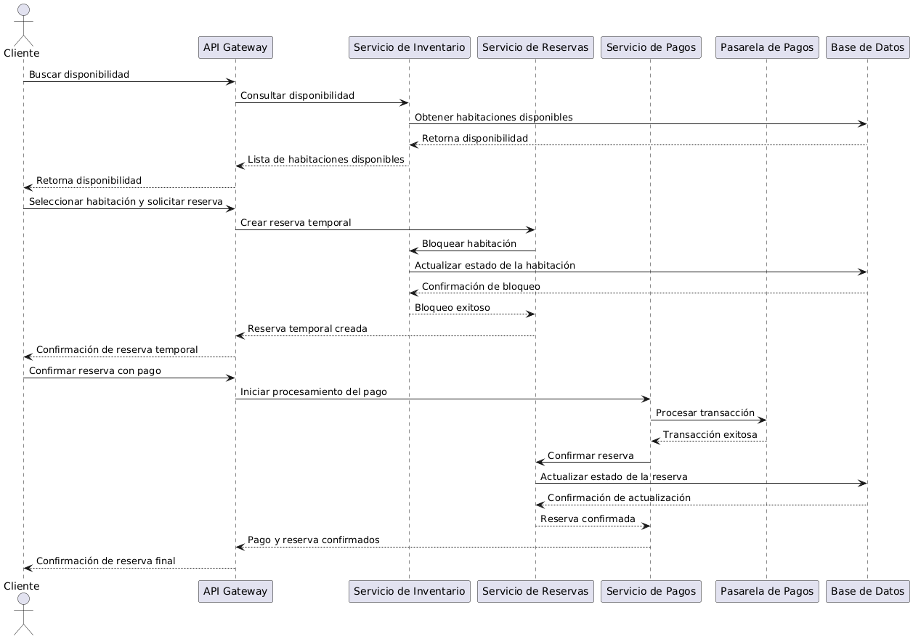

---

### **Descripción del Flujo**
1. **Búsqueda de Disponibilidad**:
   - El cliente solicita la disponibilidad de habitaciones.
   - La solicitud pasa por el API Gateway al servicio de inventario, que consulta la base de datos y retorna los resultados.

2. **Selección y Creación de Reserva Temporal**:
   - El cliente selecciona una habitación.
   - El servicio de reservas bloquea temporalmente la habitación en el inventario y guarda la información en la base de datos.

3. **Confirmación y Pago**:
   - El cliente confirma la reserva realizando el pago.
   - El servicio de pagos procesa la transacción con una pasarela de pagos externa.
   - Una vez exitoso, la reserva es confirmada y se actualiza en la base de datos.

Este diagrama ilustra claramente las interacciones entre los actores y los componentes del sistema. ¿Te gustaría ajustar o detallar algún paso? 😊

<span style="color: orange;">Promtp: Podrías generar un párrafo introductorio al digrama de secuencias que no supere las 10 líneas, pero que describa bien los actores y sus acciones</span>


### **Introducción al Diagrama de Secuencias**

El diagrama de secuencias ilustra el flujo de interacción entre los principales actores y componentes del sistema durante el proceso de reservación de una habitación. El **Cliente** inicia el flujo buscando disponibilidad de habitaciones a través del **API Gateway**, que comunica la solicitud al **Servicio de Inventario**. Tras recibir la información de disponibilidad, el cliente selecciona una habitación y solicita crear una reserva temporal, que es gestionada por el **Servicio de Reservas** y coordinada con el inventario para bloquear la habitación seleccionada. Finalmente, el cliente confirma la reserva y realiza el pago. El **Servicio de Pagos** procesa la transacción mediante una **Pasarela de Pagos** externa y, tras la confirmación, el estado de la reserva se actualiza en la base de datos. Este flujo asegura una experiencia fluida y segura para el cliente.


- **d. Diagrama de Transición de Estados:** Elabora un diagrama que muestre los distintos estados por los que pasa una reserva de habitación desde su inicio hasta su conclusión, incluyendo estados como "pendiente", "confirmada", "pagada", "modificada", y "cancelada".

<span style="color: orange;">Prompt: Ahora elabora un diagrama que muestre los distintos estados (Diagrama de Transición de Estados) por los que pasa una reserva de habitación desde su inicio hasta su conclusión, incluyendo estados como "pendiente", "confirmada", "pagada", "modificada", y "cancelada". Ejemplo del resultado esperado:</span>


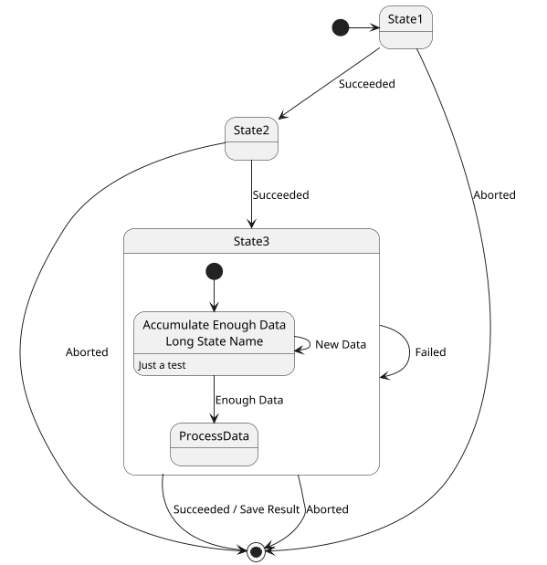


Inferencia:

Aquí tienes un diagrama de transición de estados para el ciclo de vida de una reserva de habitación:


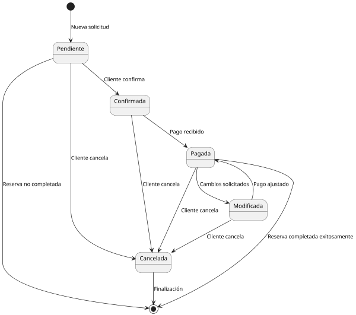

---

### **Explicación del Diagrama**
1. **Inicio**: La reserva comienza en estado **Pendiente** tras una nueva solicitud.
2. **Transiciones desde Pendiente**:
   - Puede pasar a **Confirmada** si el cliente valida la reserva.
   - Puede ser **Cancelada** si el cliente decide no continuar.
   - Puede finalizar directamente si no se completa dentro del tiempo límite.
3. **Transiciones desde Confirmada**:
   - Pasa a **Pagada** al recibir el pago.
   - Puede ser **Cancelada** si el cliente desiste.
4. **Transiciones desde Pagada**:
   - Puede moverse a **Modificada** si el cliente realiza cambios en la reserva.
   - Puede ser **Cancelada** en caso de necesidad.
5. **Transiciones desde Modificada**:
   - Regresa a **Pagada** si se ajusta el pago tras los cambios.
   - Puede ser **Cancelada** si el cliente decide no continuar.
6. **Finalización**:
   - Una reserva **Pagada** puede completarse exitosamente.
   - Una reserva **Cancelada** finaliza en estado de cancelación.

Este modelo refleja el ciclo de vida típico de una reserva, incluyendo eventos clave y excepciones comunes. ¿Deseas ajustar o ampliar algún estado o transición? 😊

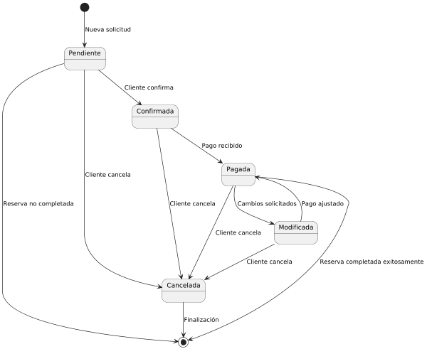

<span style="color: orange;">
Prompt: podrías ampliar en el diagrama de estados incluyendo todos los componentes de los que habíamos hablado:
Servicio de Gestión de Habitaciones
Servicio de Reservas
Servicio de Usuarios y Clientes
Servicio de Pagos
Servicio de Notificaciones
Servicio de Disponibilidad en Tiempo Real
Servicio de Reportes y Analítica, etc
</span>

Inferencia:

¡Claro! Para ampliar el **Diagrama de Estados** e incluir todos los componentes relevantes, se debe representar cómo cada servicio interactúa o reacciona en las transiciones de los estados de una reserva. Esto agrega una visión más rica de las responsabilidades distribuidas en los componentes. Aquí está el diagrama actualizado:

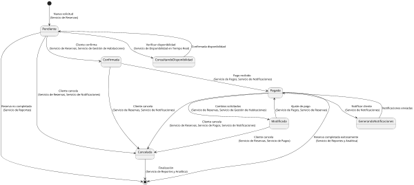

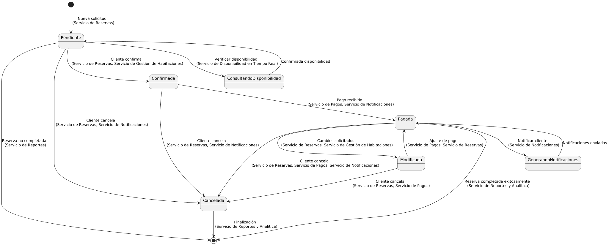

---

### **Descripción del Diagrama Ampliado**
1. **Servicios por Estado**:
   - **Pendiente**: Principalmente gestionado por el **Servicio de Reservas**, con interacciones del **Servicio de Disponibilidad en Tiempo Real** para verificar habitaciones disponibles.
   - **Confirmada**: Involucra al **Servicio de Gestión de Habitaciones** para bloquear habitaciones y al **Servicio de Notificaciones** para informar al cliente.
   - **Pagada**: Gestionada por el **Servicio de Pagos**, que notifica al cliente y registra la transacción.
   - **Cancelada**: Afecta al **Servicio de Reservas**, que debe liberar recursos, y al **Servicio de Notificaciones**, que informa al cliente.
   - **Modificada**: Se centra en la coordinación entre el **Servicio de Reservas**, el **Servicio de Gestión de Habitaciones** y el **Servicio de Pagos** para reflejar los ajustes.

2. **Estados Adicionales**:
   - **ConsultandoDisponibilidad**: Un estado intermedio donde el sistema confirma en tiempo real si la habitación está disponible.
   - **GenerandoNotificaciones**: Un paso para garantizar que el cliente reciba información sobre la reserva, pagos o modificaciones.

3. **Finalización y Reportes**:
   - Estados finales como **Pagada** o **Cancelada** se informan al **Servicio de Reportes y Analítica** para consolidar datos y métricas.

Este modelo muestra cómo cada servicio participa activamente en el ciclo de vida de una reserva y ayuda a comprender sus responsabilidades en cada transición. ¿Te gustaría más detalles en algún punto? 😊


### 3. Estructura de Carpetas del Proyecto
- Define una estructura de carpetas organizada para el proyecto de desarrollo del sistema de reservación de habitaciones, considerando la separación de componentes de frontend, backend, y servicios de integración.

<span style="color: orange;">
Prompt: Para el mismo proyecto de reservas,  genera  una estructura de directorios organizado para el proyecto de desarrollo del sistema de reservación de habitaciones, considerando la separación de componentes de frontend, backend, y servicios de integración. El diagrama debe ser un 'arbol' donde se visualicen claramente todos los componentes del sistema
</span>

Inferencia:

Aquí tienes la estructura de directorios propuesta para el sistema de reservación de habitaciones, organizada como un árbol para reflejar la separación clara de componentes:

```plaintext
sistema-reservas/
├── backend/
│   ├── app/
│   │   ├── controllers/          # Controladores del sistema
│   │   │   ├── AuthController.php
│   │   │   ├── ReservasController.php
│   │   │   ├── PagosController.php
│   │   │   └── ...
│   │   ├── models/               # Modelos de datos
│   │   │   ├── Usuario.php
│   │   │   ├── Reserva.php
│   │   │   ├── Habitacion.php
│   │   │   └── ...
│   │   ├── services/             # Lógica de negocio
│   │   │   ├── AuthService.php
│   │   │   ├── ReservasService.php
│   │   │   ├── PagosService.php
│   │   │   └── ...
│   │   ├── views/                # Plantillas de vistas (en caso de ser necesario)
│   │   │   └── ...
│   │   └── helpers/              # Utilidades y funciones generales
│   │       └── ...
│   ├── config/
│   │   ├── database.php          # Configuración de base de datos
│   │   ├── app.php               # Configuración general del backend
│   │   └── ...
│   ├── routes/
│   │   └── api.php               # Rutas de la API
│   └── tests/
│       ├── unit/                 # Pruebas unitarias
│       └── integration/          # Pruebas de integración
├── frontend/
│   ├── src/
│   │   ├── components/           # Componentes reutilizables
│   │   │   ├── Header.vue
│   │   │   ├── Footer.vue
│   │   │   └── ...
│   │   ├── views/                # Vistas principales
│   │   │   ├── Home.vue
│   │   │   ├── Login.vue
│   │   │   ├── Reservas.vue
│   │   │   └── ...
│   │   ├── store/                # Gestión del estado global (Vuex, Redux, etc.)
│   │   │   └── ...
│   │   ├── assets/               # Archivos estáticos (CSS, imágenes, etc.)
│   │   │   ├── css/
│   │   │   └── images/
│   │   └── utils/                # Utilidades y funciones auxiliares
│   │       └── ...
│   ├── public/                   # Archivos públicos para despliegue
│   └── tests/                    # Pruebas unitarias del frontend
├── services/
│   ├── availability/             # Microservicio de Disponibilidad
│   │   └── ...
│   ├── payments/                 # Microservicio de Pagos
│   │   └── ...
│   ├── notifications/            # Microservicio de Notificaciones
│   │   └── ...
│   ├── analytics/                # Microservicio de Reportes
│   │   └── ...
│   └── integrations/             # Integraciones con servicios externos
│       ├── booking/
│       ├── airbnb/
│       └── ...
├── infrastructure/
│   ├── docker/                   # Configuración de contenedores Docker
│   │   ├── Dockerfile
│   │   ├── docker-compose.yml
│   │   └── ...
│   ├── scripts/                  # Scripts de despliegue y mantenimiento
│   │   └── ...
│   ├── monitoring/               # Configuración de monitoreo
│   │   └── ...
│   └── deployment/               # Archivos de configuración para despliegues (Kubernetes, Terraform, etc.)
│       └── ...
└── docs/                         # Documentación del sistema
    ├── api-docs/                 # Documentación de la API
    ├── architecture/             # Diagramas y explicaciones arquitectónicas
    ├── user-guides/              # Manuales de usuario
    └── ...

```

---

### **Explicación de la Estructura**
1. **`backend/`**: 
   - Contiene la lógica del servidor, dividida en controladores, modelos, servicios, y utilidades. Incluye rutas y configuración.
   
2. **`frontend/`**:
   - Contiene la aplicación del cliente (por ejemplo, basada en Vue.js, React, etc.), organizada en componentes, vistas y utilidades.

3. **`services/`**:
   - Incluye microservicios independientes para disponibilidad, pagos, notificaciones, reportes, y cualquier integración externa.

4. **`infrastructure/`**:
   - Contiene configuraciones relacionadas con el despliegue, como Docker, scripts de automatización y monitoreo.

5. **`docs/`**:
   - Centraliza toda la documentación técnica y funcional del proyecto.

Esta estructura permite mantener una separación clara de responsabilidades, facilita la escalabilidad del sistema y hace que el mantenimiento sea más eficiente. ¿Deseas agregar algo más? 😊


## Nota para los Estudiantes
Este proyecto es una oportunidad para explorar cómo la IA puede ser una herramienta poderosa en el proceso de diseño y arquitectura de software. Se espera que los estudiantes no solo se apoyen en la IA para generar los diagramas, sino que también apliquen un pensamiento crítico para analizar y mejorar los resultados proporcionados por la IA. La capacidad de colaborar con herramientas avanzadas y de adaptarse a nuevas tecnologías será esencial en su futuro profesional en el campo del desarrollo de software.
