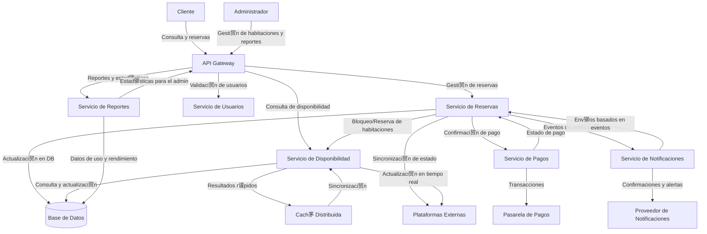
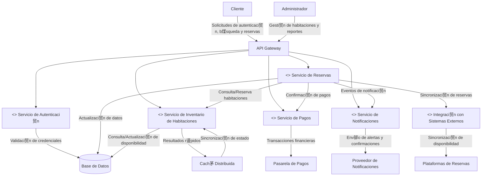
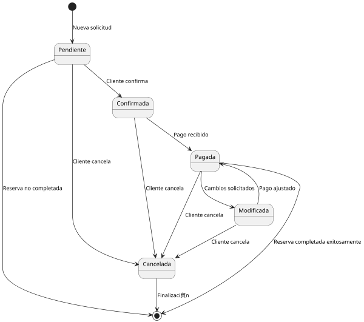

# Challenge: Dise帽o y Arquitectura de microservicios para un sistema de reservaci贸n de habitaciones con Asistencia de Inteligencia Artificial

## Objetivos del Proyecto
Este proyecto final tiene como objetivo aplicar los conocimientos adquiridos en el curso sobre dise帽o y arquitectura de software, con un enfoque especial en la utilizaci贸n de herramientas de Inteligencia Artificial (IA) para facilitar y mejorar el proceso de dise帽o. Los estudiantes utilizar谩n la IA para generar diagramas cruciales que representen la arquitectura de microservicios para un sistema de reservaci贸n de habitaciones, con un enfoque escalable y robusto.

## Descripci贸n del Proyecto
El proyecto consiste en dise帽ar la arquitectura de un sistema de reservaci贸n de habitaciones. Este sistema permite a los usuarios buscar, reservar y gestionar habitaciones en hoteles a trav茅s de aplicaciones web y m贸viles. Los estudiantes deber谩n considerar aspectos clave como la disponibilidad en tiempo real, la integraci贸n con sistemas de pago, la gesti贸n de cancelaciones y modificaciones de reservas, la escalabilidad para manejar picos de demanda, y la seguridad de los datos personales y de las transacciones.

## Tareas a Realizar

### 1. Investigaci贸n Preliminar
- Comprender el funcionamiento b谩sico de un sistema de reservaci贸n de habitaciones.

<span style="color: orange;">Prompt: 驴Conoces o sabes c贸mo funciona un sistema de reserva de habitaciones?</span>


Inferencia: 隆Claro! Un sistema de reserva de habitaciones es una aplicaci贸n que permite a los usuarios consultar, seleccionar y reservar habitaciones disponibles en un lugar, como un hotel, un hostal o un alojamiento vacacional. A continuaci贸n, te detallo los componentes y c贸mo funciona generalmente:
Componentes Clave

    Interfaz de Usuario (Frontend):
        Muestra las habitaciones disponibles, precios, descripciones e im谩genes.
        Ofrece filtros para buscar por fecha, precio, n煤mero de personas, etc.
        Formulario para realizar la reserva con los datos del cliente.

    Base de Datos:
        Contiene informaci贸n sobre las habitaciones (n煤mero, tipo, capacidad, estado, precio, etc.).
        Registro de reservas: qui茅n, cu谩ndo, y detalles del pago.
        Registro de usuarios o clientes.

    L贸gica del Servidor (Backend):
        Gestiona la disponibilidad de habitaciones seg煤n las fechas seleccionadas.
        Procesa las reservas y guarda los datos en la base de datos.
        Maneja la l贸gica de conflictos (por ejemplo, evitar dobles reservas).

    Sistema de Pago (Opcional):
        Integraci贸n con pasarelas de pago (PayPal, Stripe, etc.) para gestionar pagos seguros.

    Notificaciones:
        Correos electr贸nicos o SMS para confirmar reservas, recordatorios o facturas.

C贸mo Funciona

    Consulta de Disponibilidad:
        El usuario introduce fechas de entrada y salida, junto con detalles (n煤mero de personas, tipo de habitaci贸n).
        El sistema consulta la base de datos para encontrar habitaciones disponibles que coincidan con los criterios.

    Selecci贸n de Habitaci贸n:
        Se presentan las opciones al usuario.
        El usuario selecciona la habitaci贸n deseada y procede con la reserva.

    Proceso de Reserva:
        El usuario introduce sus datos (nombre, contacto, etc.).
        Si el sistema est谩 integrado con un procesador de pagos, se realiza el pago en este paso.

    Confirmaci贸n:
        Una vez confirmada la reserva (y el pago si aplica), el sistema actualiza el estado de la habitaci贸n a "reservada" para las fechas seleccionadas.
        Se env铆a una notificaci贸n al cliente con los detalles de la reserva.

    Gesti贸n de Reservas:
        El administrador del sistema puede modificar, cancelar o revisar reservas a trav茅s de un panel de control.

Retos Comunes

    Evitar dobles reservas: Implementar bloqueos temporales mientras el cliente completa el proceso.
    Sincronizaci贸n en tiempo real: Si el sistema est谩 integrado con otras plataformas (como Booking.com o Airbnb).
    Seguridad: Proteger los datos de los usuarios y transacciones con cifrado.

驴Planeas implementar algo similar o tienes dudas espec铆ficas sobre alguna parte del proceso? 

<span style="color: orange;">Prompt: Necesito profundizar el sistema de reservas. Enfocado en las caracter铆sticas que debe poseer un sistema de reserva de habitaciones con una arquitectura de microservicios y cuyo enfoque principal es ser escalable y robusto. 驴Podr铆as reformular tu respuesta anterior considerando estos aspectos claves del sistema?</span>

Inferencia: 隆Claro! Si el objetivo es dise帽ar un **sistema de reserva de habitaciones** con una **arquitectura de microservicios**, orientado a la **escalabilidad** y **robustez**, es importante abordar las caracter铆sticas desde la perspectiva de una arquitectura distribuida. Aqu铆 tienes una reformulaci贸n m谩s t茅cnica y enfocada:

---

### **Componentes Clave en una Arquitectura de Microservicios**

#### **1. Microservicios Principales**
1. **Servicio de Gesti贸n de Habitaciones**:
   - Almacena y administra los datos de las habitaciones (n煤mero, tipo, capacidad, estado, precio).
   - Expone API para consultar disponibilidad, actualizar el estado y modificar detalles de las habitaciones.

2. **Servicio de Reservas**:
   - Maneja el flujo de reservas: verificar disponibilidad, bloquear habitaciones temporalmente, confirmar o cancelar reservas.
   - Implementa l贸gica para manejar conflictos de concurrencia, garantizando que no se produzcan dobles reservas.

3. **Servicio de Usuarios y Clientes**:
   - Gestiona el registro, autenticaci贸n y perfiles de usuarios (clientes y administradores).
   - Ofrece integraci贸n con sistemas de identidad (OAuth, SSO).

4. **Servicio de Pagos**:
   - Procesa pagos seguros mediante integraciones con pasarelas de pago (Stripe, PayPal, etc.).
   - Implementa l贸gica de reembolsos y manejo de errores transaccionales.

5. **Servicio de Notificaciones**:
   - Env铆a confirmaciones de reserva, recordatorios o alertas a trav茅s de correo electr贸nico, SMS o notificaciones push.

6. **Servicio de Disponibilidad en Tiempo Real**:
   - Actualiza y sincroniza el estado de las habitaciones en tiempo real, especialmente si el sistema se conecta a plataformas externas (como Booking.com, Airbnb, etc.).

7. **Servicio de Reportes y Anal铆ticas**:
   - Genera reportes sobre ocupaci贸n, ingresos, cancelaciones y estad铆sticas clave para el negocio.
   - Proporciona anal铆ticas en tiempo real para la toma de decisiones.

---

### **Caracter铆sticas Clave para Escalabilidad y Robustez**

#### **1. Escalabilidad**
- **Desacoplamiento entre Servicios**:
  - Cada servicio es independiente y puede ser escalado horizontalmente seg煤n la carga (por ejemplo, el servicio de pagos durante la temporada alta).
  
- **Mensajer铆a As铆ncrona**:
  - Utilizar un **Message Broker** (como RabbitMQ o Kafka) para la comunicaci贸n entre servicios. Esto desacopla los servicios y mejora la resiliencia ante altas cargas.

- **Cach茅 Distribuida**:
  - Implementar un sistema como Redis o Memcached para almacenar resultados frecuentes, como disponibilidad de habitaciones para b煤squedas r谩pidas.

- **Uso de Bases de Datos Distribuidas**:
  - Bases de datos como **Cassandra**, **CockroachDB**, o **PostgreSQL** con replicaci贸n y particionado para manejar grandes vol煤menes de datos de manera eficiente.

#### **2. Robustez**
- **Tolerancia a Fallos**:
  - Cada microservicio debe manejar errores localmente y usar patrones como **Circuit Breaker** (con herramientas como Resilience4j) para evitar cascadas de fallos.

- **Transacciones Distribuidas**:
  - Implementar patrones como **Sagas** para manejar transacciones distribuidas entre servicios (por ejemplo, confirmar reserva y procesar el pago).

- **Balanceo de Carga**:
  - Usar herramientas como NGINX o un servicio de balanceo en la nube para distribuir el tr谩fico de manera uniforme.

- **Monitorizaci贸n y Observabilidad**:
  - Integrar herramientas como Prometheus, Grafana y ELK Stack (Elasticsearch, Logstash, Kibana) para monitorear m茅tricas, logs y detectar problemas.

- **Backup y Recuperaci贸n**:
  - Automatizar respaldos peri贸dicos y asegurar planes de recuperaci贸n ante desastres.

---

### **Flujo de Trabajo en un Sistema Distribuido**

1. **Consulta de Disponibilidad**:
   - El cliente env铆a una solicitud al **API Gateway**, que redirige la consulta al **Servicio de Disponibilidad**.
   - Este servicio consulta el estado de las habitaciones desde la base de datos (o la cach茅 si aplica).

2. **Selecci贸n de Habitaci贸n y Reserva**:
   - El cliente selecciona una habitaci贸n y confirma las fechas.
   - El **Servicio de Reservas** inicia una transacci贸n distribuida para bloquear temporalmente la habitaci贸n y env铆a un evento al **Servicio de Pagos**.

3. **Confirmaci贸n de Pago**:
   - El **Servicio de Pagos** procesa la transacci贸n y notifica al **Servicio de Reservas** sobre el 茅xito o fallo.
   - Si tiene 茅xito, el estado de la habitaci贸n se actualiza a "reservada" y el cliente recibe una confirmaci贸n mediante el **Servicio de Notificaciones**.

4. **Sincronizaci贸n con Plataformas Externas** (si aplica):
   - El **Servicio de Integraci贸n de Canales** actualiza autom谩ticamente el estado en plataformas externas.

---

### **Ventajas de Esta Arquitectura**

1. **Escalabilidad**:
   - Cada servicio puede escalarse de manera independiente seg煤n las necesidades.
   
2. **Mantenimiento Simplificado**:
   - Cambios en un servicio no afectan a los dem谩s, siempre que las interfaces est茅n bien definidas.

3. **Alta Disponibilidad**:
   - Fallos en un microservicio no colapsan el sistema completo, especialmente con patrones de tolerancia a fallos.

4. **Flexibilidad**:
   - Se pueden agregar nuevas funcionalidades (como descuentos o paquetes promocionales) sin reestructurar todo el sistema.

---

Si tienes un caso de uso m谩s espec铆fico o necesitas ejemplos pr谩cticos de implementaci贸n (como usar Spring Boot, Node.js o cualquier otra tecnolog铆a), 隆puedo ayudarte a detallar m谩s! 


- Identificar los principales componentes y actores involucrados en el sistema.

<span style="color: orange;">
Prompt: Los componentes que identificaste est谩n perfectos. Profundiza, por favor, en la descripci贸n de los actores involucrados o que intervendr铆an en el sistema.
</span>

Inferencia: 隆Claro! En un sistema de reservas de habitaciones con enfoque en microservicios, los actores representan tanto a los usuarios finales como a las entidades internas o externas que interact煤an con el sistema. Aqu铆 tienes una descripci贸n detallada de cada tipo de actor y su papel:

---

### **Actores Involucrados en el Sistema**

#### **1. Usuarios Finales**
1. **Clientes**
   - **Descripci贸n**: Personas que buscan reservar habitaciones para estad铆as.
   - **Interacciones**:
     - Consultan disponibilidad de habitaciones.
     - Seleccionan fechas y realizan reservas.
     - Realizan pagos en l铆nea o seleccionan m茅todos alternativos.
     - Reciben notificaciones de confirmaci贸n o recordatorios.
   - **Requerimientos T茅cnicos**:
     - Experiencia de usuario fluida y accesible desde m煤ltiples dispositivos.
     - Capacidad para manejar alta concurrencia durante temporadas altas.

2. **Administradores del Alojamiento**
   - **Descripci贸n**: Personal del alojamiento encargado de gestionar reservas, disponibilidad y precios.
   - **Interacciones**:
     - Acceden a un panel para visualizar el estado de las reservas y habitaciones.
     - Modifican la disponibilidad manualmente (por mantenimiento, eventos especiales, etc.).
     - Gestionan tarifas y promociones.
     - Generan reportes de ocupaci贸n y rendimiento.
   - **Requerimientos T茅cnicos**:
     - Panel de administraci贸n con estad铆sticas en tiempo real.
     - Capacidad para actualizar m煤ltiples habitaciones y fechas simult谩neamente.

#### **2. Entidades Internas del Sistema**
1. **Microservicio de Reservas**
   - **Rol**: Procesa las solicitudes de reserva y asegura la consistencia del estado de las habitaciones.
   - **Interacciones**:
     - Coordina entre los servicios de disponibilidad y pagos.
     - Maneja bloqueos temporales para evitar dobles reservas.
     - Genera eventos para los servicios de notificaciones y reportes.

2. **Microservicio de Pagos**
   - **Rol**: Garantiza el procesamiento seguro de transacciones.
   - **Interacciones**:
     - Se comunica con pasarelas de pago externas para validar transacciones.
     - Notifica el 茅xito o fallo de los pagos al servicio de reservas.
     - Maneja reembolsos y disputas.
   
3. **Microservicio de Disponibilidad**
   - **Rol**: Centraliza el estado de las habitaciones y asegura respuestas r谩pidas a consultas de disponibilidad.
   - **Interacciones**:
     - Actualiza el estado en tiempo real seg煤n las reservas confirmadas.
     - Maneja sincronizaci贸n con plataformas externas (Booking, Airbnb, etc.).
     - Trabaja en conjunto con sistemas de cach茅 para optimizar el rendimiento.

4. **Microservicio de Notificaciones**
   - **Rol**: Automatiza la comunicaci贸n con los clientes.
   - **Interacciones**:
     - Env铆a correos electr贸nicos o mensajes SMS para confirmar reservas.
     - Env铆a recordatorios antes del check-in y encuestas despu茅s del check-out.
     - Notifica sobre cancelaciones o cambios de 煤ltima hora.

5. **Microservicio de Reportes y Anal铆ticas**
   - **Rol**: Proporciona informaci贸n clave para la toma de decisiones.
   - **Interacciones**:
     - Recoge datos de transacciones, ocupaci贸n y actividad del sistema.
     - Genera reportes automatizados para administradores.

#### **3. Actores Externos**
1. **Pasarelas de Pago**
   - **Descripci贸n**: Servicios externos que procesan pagos electr贸nicos.
   - **Interacciones**:
     - Validan tarjetas de cr茅dito/d茅bito o m茅todos alternativos como PayPal.
     - Devuelven el estado de la transacci贸n (茅xito, fallo, fraude detectado).
   - **Requerimientos T茅cnicos**:
     - APIs robustas y seguras.
     - Soporte para m煤ltiples monedas y m茅todos de pago.

2. **Plataformas de Terceros**
   - **Descripci贸n**: Agencias de viajes en l铆nea (OTA) como Booking.com, Expedia o Airbnb.
   - **Interacciones**:
     - Sincronizan la disponibilidad de habitaciones con el sistema interno.
     - Reciben confirmaciones de reservas para su procesamiento.
   - **Requerimientos T茅cnicos**:
     - Integraciones API para mantener la sincronizaci贸n bidireccional en tiempo real.
     - Mecanismos de reconciliaci贸n para evitar conflictos.

3. **Proveedores de Notificaciones**
   - **Descripci贸n**: Servicios externos como Twilio, SendGrid o Firebase.
   - **Interacciones**:
     - Env铆an mensajes a clientes finales seg煤n eventos generados por el sistema.
     - Proveen m茅tricas de entrega y estado de los mensajes.
   - **Requerimientos T茅cnicos**:
     - Alta disponibilidad para garantizar la entrega de notificaciones cr铆ticas.

---

### **Interacci贸n Entre los Actores**

#### **Escenario T铆pico: Reserva**
1. El **Cliente** consulta disponibilidad.
   - La solicitud se dirige al **Microservicio de Disponibilidad**.
   - Este responde con las habitaciones disponibles desde la base de datos o la cach茅.

2. El cliente selecciona una habitaci贸n y confirma la reserva.
   - El **Microservicio de Reservas** bloquea temporalmente la habitaci贸n.
   - Env铆a una solicitud al **Microservicio de Pagos** para procesar el pago.

3. Si el pago es exitoso:
   - El estado de la habitaci贸n se actualiza a "reservada".
   - Se genera un evento para el **Microservicio de Notificaciones**, que env铆a una confirmaci贸n.

4. Si el cliente utiliz贸 una **Plataforma de Terceros**:
   - El **Servicio de Disponibilidad** sincroniza la reserva con dicha plataforma.

---

### **Resumen de Roles y Responsabilidades**

| Actor                        | Rol Principal                                          | Interacci贸n                    |
|------------------------------|-------------------------------------------------------|--------------------------------|
| **Cliente**                  | Realiza reservas y pagos                              | Frontend/API Gateway           |
| **Administrador**            | Gestiona disponibilidad, tarifas y reportes          | Panel de administraci贸n        |
| **Microservicio de Reservas**| Coordina reservas y transacciones                    | Base de datos, servicios internos |
| **Pasarela de Pagos**        | Procesa transacciones financieras                    | API externa                    |
| **Proveedor de Notificaciones** | Env铆a mensajes y confirmaciones                     | Servicio externo               |
| **Plataformas Externas**     | Sincronizan disponibilidad y reservas                | APIs externas                  |

---

驴Tienes en mente alg煤n actor adicional o alg煤n caso de uso particular que quieras desarrollar m谩s? 


### 2. Generaci贸n de Diagramas con IA
Los estudiantes utilizar谩n herramientas de IA para generar los siguientes diagramas, espec铆ficos para el dise帽o de un sistema de reservaci贸n de habitaciones:

<span style="color: orange;">
Prompt: Con todo el contexto que hemos generado para el sistema de reservas, est谩s en condiciones de generar algunos diagramas en formato mermaid? No los generes a煤n, solo confirma si necesitas m谩s informaci贸n o si te gustar铆a recibir m谩s contexto.
</span>

Inferencia: S铆, puedo generar diagramas en formato **Mermaid** con el contexto que ya hemos desarrollado. Estos diagramas pueden incluir:

1. **Diagrama de componentes** para mostrar los microservicios y sus interacciones.
2. **Diagrama de flujo** para describir el proceso de reserva desde la consulta hasta la confirmaci贸n.
3. **Diagrama de casos de uso** para ilustrar las interacciones entre los actores (clientes, administradores, servicios externos, etc.).
4. **Diagrama de secuencia** para detallar el flujo entre los servicios durante una operaci贸n espec铆fica, como una reserva o pago.

Si tienes alg煤n escenario o componente espec铆fico que quieras priorizar en los diagramas, o si deseas agregar m谩s detalles t茅cnicos (como herramientas espec铆ficas, endpoints API, etc.), h谩zmelo saber antes de comenzar. 

- **a. Diagrama de Arquitectura de Software en Mermaid:** Crea un diagrama que visualice los componentes principales del sistema de reservaci贸n de habitaciones y c贸mo interact煤an entre s铆. Este debe incluir servicios como el motor de b煤squeda, gesti贸n de reservas, procesamiento de pagos, notificaciones, y administraci贸n de disponibilidad en tiempo real.

<span style="color: orange;">
Prompt: Necesito un diagrama de arquitectura de software, en formato mermaid, donde se pueda visualizar claramente la interacci贸n entre los diferentes componentes del sistema que fueron individualizados anteriormente. El diagrama debe ser lo m谩s claro posible, pero sin descuidar detalles de la interacci贸n entre los componente. 
</span>

Inferencia: Aqu铆 tienes el **diagrama de arquitectura de software** en formato **Mermaid**, dise帽ado para mostrar las interacciones entre los microservicios, los actores principales y los servicios externos. El foco est谩 en reflejar claramente c贸mo se comunican los componentes y el flujo entre ellos:



---

### **Descripci贸n del Diagrama**
1. **Actores principales**: El cliente y el administrador interact煤an con el sistema a trav茅s del **API Gateway**.
2. **Microservicios principales**:
   - **Servicio de Reservas** gestiona el flujo central: bloqueo de habitaciones, pagos y notificaciones.
   - **Servicio de Disponibilidad** se conecta a la base de datos y utiliza una **cach茅 distribuida** para mejorar el rendimiento.
   - **Servicio de Usuarios** valida a los usuarios finales (clientes y administradores).
   - **Servicio de Pagos** gestiona la interacci贸n con la pasarela de pagos.
   - **Servicio de Notificaciones** maneja el env铆o de correos y alertas, dependiendo de eventos generados.
   - **Servicio de Reportes** genera estad铆sticas y reportes basados en datos almacenados.
3. **Servicios externos**:
   - **Pasarelas de Pago** procesan transacciones.
   - **Proveedores de Notificaciones** entregan mensajes al cliente.
   - **Plataformas Externas** sincronizan disponibilidad y reservas en tiempo real.

---

Si necesitas alg煤n ajuste, como detalles m谩s espec铆ficos en alg煤n flujo o un 茅nfasis en un componente particular, puedo adaptarlo. 

<span style="color: orange;">
Prompt: Necesito un texto explicativo que sirva como introducci贸n de lo que se visualiza en el diagrama. Una breve explicaci贸n del mismo. 
</span>

Inferencia: 

### **Introducci贸n al Diagrama de Arquitectura del Sistema de Reservas**

El diagrama representa la arquitectura del sistema de reservas de habitaciones, dise帽ado bajo una arquitectura de **microservicios** para garantizar **escalabilidad**, **robustez** y **modularidad**. Cada componente cumple un rol espec铆fico y se comunica de manera controlada, promoviendo la independencia y la reutilizaci贸n de servicios.

---

### **Descripci贸n General**

1. **Interacci贸n con los Actores**:
   - Los **clientes** y **administradores** interact煤an con el sistema a trav茅s de un **API Gateway**, que centraliza las solicitudes y las distribuye hacia los microservicios correspondientes.
   - Los clientes realizan consultas de disponibilidad, reservas y pagos, mientras que los administradores gestionan habitaciones, precios y reportes.

2. **Componentes Internos del Sistema**:
   - **Servicio de Reservas**: Es el n煤cleo del sistema, gestionando las reservas desde el bloqueo temporal de habitaciones hasta la confirmaci贸n, coordinando con los servicios de pagos y notificaciones.
   - **Servicio de Disponibilidad**: Responde consultas sobre el estado de las habitaciones, optimizando el rendimiento mediante una cach茅 distribuida y sincronizando cambios con la base de datos.
   - **Servicio de Pagos**: Procesa transacciones de manera segura integr谩ndose con pasarelas de pago externas.
   - **Servicio de Notificaciones**: Gestiona la comunicaci贸n con los clientes y administradores mediante proveedores externos para correos y mensajes.
   - **Servicio de Reportes**: Consolida datos sobre reservas, ocupaci贸n y rendimiento para generar estad铆sticas y reportes 煤tiles para la administraci贸n.

3. **Servicios Externos**:
   - La arquitectura interact煤a con **pasarelas de pago**, **proveedores de notificaciones**, y **plataformas de terceros** (como Booking.com o Airbnb) para sincronizar disponibilidad y reservas.

4. **Base de Datos y Cach茅**:
   - La base de datos central almacena informaci贸n estructurada sobre habitaciones, usuarios y reservas, mientras que una **cach茅 distribuida** acelera las respuestas a consultas frecuentes.

---

Este dise帽o modular asegura que cada microservicio pueda ser escalado y mantenido de forma independiente, permitiendo una respuesta eficiente a altas demandas y una alta disponibilidad del sistema.

<span style="color: orange;">
Prompt: Ahora utilizar茅 algunas 'plantillas' para indicarte el diagrama que necesito, para que lo generes basado en el contexto que hemos venido trabajando, est谩s listo?
</span>

Inferencia: 隆Por supuesto! Estoy listo para recibir las plantillas o instrucciones y generar el diagrama correspondiente en Mermaid, adaptado al contexto que hemos trabajado. Adelante con los detalles. 


- **b. Diagrama UML de Componentes:** Desarrolla un diagrama UML que muestre los componentes del sistema de reservaci贸n de habitaciones y sus relaciones, destacando la comunicaci贸n entre m贸dulos como el sistema de autenticaci贸n de usuarios, el servicio de inventario de habitaciones, y la integraci贸n con sistemas externos como procesadores de pago y canales de notificaci贸n.

<span style="color: orange;">
Prompt: Descripci贸n del comportamiento a modelar: Ilustrar los componentes del sistema de reservaci贸n de habitaciones y sus relaciones, destacando la comunicaci贸n entre m贸dulos como el sistema de autenticaci贸n de usuarios, el servicio de inventario de habitaciones, y la integraci贸n con sistemas externos como procesadores de pago y canales de notificaci贸n.
Diagrama deseado: Diagrama UML de Componentes
Restricciones: Formato diagrama UML
</span>

隆Entendido! Aqu铆 tienes el Diagrama UML de Componentes en formato Mermaid, modelando el comportamiento descrito:



---

### **Explicaci贸n del Diagrama**
1. **Actores Principales**:
   - **Cliente** y **Administrador** interact煤an con el sistema a trav茅s del **API Gateway**, que act煤a como un punto de entrada centralizado.
   
2. **Componentes Internos**:
   - **Servicio de Autenticaci贸n**: Valida las credenciales de los usuarios consultando la base de datos.
   - **Servicio de Reservas**: Maneja el flujo principal de reservas, coordinando con el servicio de inventario, pagos y notificaciones.
   - **Servicio de Inventario**: Gestiona la disponibilidad de habitaciones y utiliza una **cach茅 distribuida** para respuestas r谩pidas.
   - **Servicio de Pagos**: Procesa transacciones financieras mediante una integraci贸n con pasarelas de pago externas.
   - **Servicio de Notificaciones**: Env铆a confirmaciones, recordatorios o alertas mediante proveedores de servicios externos.
   - **Integraci贸n con Sistemas Externos**: Sincroniza disponibilidad y reservas con plataformas externas como Booking.com o Airbnb.

3. **Base de Datos y Cach茅**:
   - La base de datos almacena informaci贸n estructurada, mientras que la cach茅 optimiza la consulta de datos frecuentes (como la disponibilidad de habitaciones).

4. **Servicios Externos**:
   - La arquitectura interact煤a con **pasarelas de pago**, **proveedores de notificaciones** y **plataformas externas**, asegurando la integraci贸n y sincronizaci贸n en tiempo real.

Este diagrama captura la comunicaci贸n y relaciones entre los m贸dulos internos y externos, destacando su interoperabilidad y modularidad. 驴Te gustar铆a alg煤n ajuste o agregar m谩s detalles? 

<span style="color: orange;">
Prompt: Podr铆as corregir el diagrama anterior creando un diagrama de tipo UML (no mermaid) que represente la arquitectura del sistema de reserva de habitaciones y las diferentes capas de aplicaci贸n que deben existir. 
</span>

Inferencia: Crear茅 un diagrama UML que represente la arquitectura del sistema de reservas de habitaciones, organizando los componentes en **capas de aplicaci贸n**. Este diagrama incluir谩 las capas t铆picas de una arquitectura bien estructurada, como presentaci贸n, l贸gica de negocio, integraci贸n y persistencia, adem谩s de las interacciones clave entre ellas. Aqu铆 est谩 el diagrama en descripci贸n textual (puedes convertirlo a un dibujo en una herramienta de diagramaci贸n):

---

### **Diagrama UML: Arquitectura por Capas**

```plaintext
+---------------------------------------------------------------+
|                        Capa de Presentaci贸n                  |
|---------------------------------------------------------------|
| - Interfaz de Usuario (Cliente Web, App M贸vil)               |
| - API Gateway                                                |
+---------------------------------------------------------------+
                         |
                         V
+---------------------------------------------------------------+
|                     Capa de L贸gica de Negocio                |
|---------------------------------------------------------------|
| - Servicio de Autenticaci贸n                                  |
| - Servicio de Reservas                                       |
| - Servicio de Inventario de Habitaciones                    |
| - Servicio de Pagos                                          |
| - Servicio de Notificaciones                                 |
| - Servicio de Reportes                                       |
+---------------------------------------------------------------+
                         |
                         V
+---------------------------------------------------------------+
|                  Capa de Integraci贸n                         |
|---------------------------------------------------------------|
| - Integraci贸n con Pasarela de Pagos                          |
| - Integraci贸n con Proveedores de Notificaciones              |
| - Integraci贸n con Plataformas Externas (Booking, Airbnb)     |
+---------------------------------------------------------------+
                         |
                         V
+---------------------------------------------------------------+
|                   Capa de Persistencia                       |
|---------------------------------------------------------------|
| - Base de Datos (Usuarios, Habitaciones, Reservas)           |
| - Cach茅 Distribuida (Disponibilidad, Datos Temporales)       |
+---------------------------------------------------------------+
```

---

### **Explicaci贸n del Diagrama**

#### **1. Capa de Presentaci贸n**
- Proporciona la interfaz que utilizan los actores para interactuar con el sistema.
- Incluye el **API Gateway**, que act煤a como intermediario entre los clientes y los microservicios.

#### **2. Capa de L贸gica de Negocio**
- Contiene los microservicios que implementan la l贸gica principal del sistema:
  - **Autenticaci贸n**: Valida usuarios y sesiones.
  - **Reservas**: Gestiona el proceso completo de reserva, integr谩ndose con el inventario y pagos.
  - **Inventario**: Consulta y actualiza la disponibilidad de habitaciones.
  - **Pagos**: Procesa transacciones y coordina con pasarelas externas.
  - **Notificaciones**: Env铆a confirmaciones, recordatorios o alertas.
  - **Reportes**: Consolida datos y genera estad铆sticas para administradores.

#### **3. Capa de Integraci贸n**
- Se encarga de conectar los microservicios internos con servicios y sistemas externos:
  - **Pasarela de Pagos**: Procesa transacciones de forma segura.
  - **Proveedores de Notificaciones**: Gestionan el env铆o de correos, SMS o notificaciones push.
  - **Plataformas Externas**: Sincronizan inventario y reservas con sistemas como Booking.com.

#### **4. Capa de Persistencia**
- Gestiona el almacenamiento de datos:
  - **Base de Datos**: Almacena informaci贸n estructurada de usuarios, habitaciones y reservas.
  - **Cach茅 Distribuida**: Mejora el rendimiento almacenando datos frecuentemente consultados.

---

Este esquema presenta la arquitectura por capas y sugiere c贸mo organizar los componentes del sistema. Si necesitas un dibujo en herramientas UML, puedo guiarte con herramientas como Lucidchart, Visual Paradigm o Diagrams.net para hacerlo. 

<span style="color: orange;">
Prompt: 驴puedes generar el Diagrama UML: Arquitectura por Capas para Diagrams.net?
</span>

Inferencia: Puedo generarte el contenido en formato XML para que lo utilices directamente en **Diagrams.net** (anteriormente conocido como Draw.io). Este diagrama reflejar谩 la arquitectura por capas descrita, y lo puedes importar f谩cilmente. Aqu铆 est谩 el c贸digo XML:

```xml
<?xml version="1.0" encoding="UTF-8"?>
<mxfile host="app.diagrams.net">
  <diagram name="Arquitectura por Capas">
    <mxGraphModel dx="1040" dy="642" grid="1" gridSize="10" guides="1" tooltips="1" connect="1" arrows="1" fold="1" page="1" pageScale="1" pageWidth="827" pageHeight="1169" math="0" shadow="0">
      <root>
        <mxCell id="0" />
        <mxCell id="1" parent="0" />
        
        <!-- Capa de Presentaci贸n -->
        <mxCell id="presentationLayer" value="Capa de Presentaci贸n" style="rounded=1;whiteSpace=wrap;html=1;fillColor=#D5E8D4;strokeColor=#82B366;" vertex="1" parent="1">
          <mxGeometry x="20" y="20" width="720" height="80" as="geometry" />
        </mxCell>
        <mxCell id="uiComponent" value="Interfaz de Usuario (Cliente Web, App M贸vil)" style="rounded=0;whiteSpace=wrap;html=1;strokeColor=#6C8EBF;" vertex="1" parent="presentationLayer">
          <mxGeometry x="10" y="10" width="700" height="30" as="geometry" />
        </mxCell>
        <mxCell id="apiGateway" value="API Gateway" style="rounded=0;whiteSpace=wrap;html=1;strokeColor=#6C8EBF;" vertex="1" parent="presentationLayer">
          <mxGeometry x="10" y="50" width="700" height="30" as="geometry" />
        </mxCell>
        
        <!-- Capa de L贸gica de Negocio -->
        <mxCell id="businessLayer" value="Capa de L贸gica de Negocio" style="rounded=1;whiteSpace=wrap;html=1;fillColor=#FFF2CC;strokeColor=#D6B656;" vertex="1" parent="1">
          <mxGeometry x="20" y="120" width="720" height="180" as="geometry" />
        </mxCell>
        <mxCell id="authService" value="Servicio de Autenticaci贸n" style="rounded=0;whiteSpace=wrap;html=1;strokeColor=#D6B656;" vertex="1" parent="businessLayer">
          <mxGeometry x="10" y="10" width="700" height="30" as="geometry" />
        </mxCell>
        <mxCell id="reservationsService" value="Servicio de Reservas" style="rounded=0;whiteSpace=wrap;html=1;strokeColor=#D6B656;" vertex="1" parent="businessLayer">
          <mxGeometry x="10" y="50" width="700" height="30" as="geometry" />
        </mxCell>
        <mxCell id="inventoryService" value="Servicio de Inventario de Habitaciones" style="rounded=0;whiteSpace=wrap;html=1;strokeColor=#D6B656;" vertex="1" parent="businessLayer">
          <mxGeometry x="10" y="90" width="700" height="30" as="geometry" />
        </mxCell>
        <mxCell id="paymentsService" value="Servicio de Pagos" style="rounded=0;whiteSpace=wrap;html=1;strokeColor=#D6B656;" vertex="1" parent="businessLayer">
          <mxGeometry x="10" y="130" width="700" height="30" as="geometry" />
        </mxCell>
        <mxCell id="notificationsService" value="Servicio de Notificaciones" style="rounded=0;whiteSpace=wrap;html=1;strokeColor=#D6B656;" vertex="1" parent="businessLayer">
          <mxGeometry x="10" y="170" width="700" height="30" as="geometry" />
        </mxCell>
        
        <!-- Capa de Integraci贸n -->
        <mxCell id="integrationLayer" value="Capa de Integraci贸n" style="rounded=1;whiteSpace=wrap;html=1;fillColor=#F8CECC;strokeColor=#B85450;" vertex="1" parent="1">
          <mxGeometry x="20" y="320" width="720" height="120" as="geometry" />
        </mxCell>
        <mxCell id="paymentGateway" value="Integraci贸n con Pasarela de Pagos" style="rounded=0;whiteSpace=wrap;html=1;strokeColor=#B85450;" vertex="1" parent="integrationLayer">
          <mxGeometry x="10" y="10" width="700" height="30" as="geometry" />
        </mxCell>
        <mxCell id="notificationProvider" value="Integraci贸n con Proveedores de Notificaciones" style="rounded=0;whiteSpace=wrap;html=1;strokeColor=#B85450;" vertex="1" parent="integrationLayer">
          <mxGeometry x="10" y="50" width="700" height="30" as="geometry" />
        </mxCell>
        <mxCell id="externalPlatforms" value="Integraci贸n con Plataformas Externas (Booking, Airbnb)" style="rounded=0;whiteSpace=wrap;html=1;strokeColor=#B85450;" vertex="1" parent="integrationLayer">
          <mxGeometry x="10" y="90" width="700" height="30" as="geometry" />
        </mxCell>
        
        <!-- Capa de Persistencia -->
        <mxCell id="persistenceLayer" value="Capa de Persistencia" style="rounded=1;whiteSpace=wrap;html=1;fillColor=#DAE8FC;strokeColor=#6C8EBF;" vertex="1" parent="1">
          <mxGeometry x="20" y="460" width="720" height="80" as="geometry" />
        </mxCell>
        <mxCell id="database" value="Base de Datos (Usuarios, Habitaciones, Reservas)" style="rounded=0;whiteSpace=wrap;html=1;strokeColor=#6C8EBF;" vertex="1" parent="persistenceLayer">
          <mxGeometry x="10" y="10" width="700" height="30" as="geometry" />
        </mxCell>
        <mxCell id="cache" value="Cach茅 Distribuida (Disponibilidad, Datos Temporales)" style="rounded=0;whiteSpace=wrap;html=1;strokeColor=#6C8EBF;" vertex="1" parent="persistenceLayer">
          <mxGeometry x="10" y="50" width="700" height="30" as="geometry" />
        </mxCell>
      </root>
    </mxGraphModel>
  </diagram>
</mxfile>
```

---

### **C贸mo usar este c贸digo**:
1. Abre [Diagrams.net (Draw.io)](https://app.diagrams.net/).
2. Ve a **Archivo > Importar desde > Archivo de dispositivo**.
3. Copia este c贸digo en un archivo `.drawio` o `.xml` y c谩rgalo en la herramienta.

Esto te generar谩 el diagrama con las capas de arquitectura organizadas, con colores y estilo limpio para personalizar si es necesario. 

<span style="color: orange;">Prompt: 驴puedes generar el Diagrama UML: Arquitectura por Capas? Ejemplo del lenguaje:</span>


@startuml
[First component]
[Another component] as Comp2
component Comp3
component [Last\ncomponent] as Comp4
@enduml


Inferencia: Aqu铆 tienes el **Diagrama UML de Arquitectura por Capas** generado en el lenguaje de PlantUML:


---

### **C贸mo usarlo**
1. Copia este c贸digo en un editor compatible con PlantUML (por ejemplo, [PlantText](https://planttext.com/) o [Diagrams.net con PlantUML](https://www.diagrams.net/)).
2. Genera el diagrama para visualizar las interacciones entre las capas.

驴Te gustar铆a a帽adir m谩s detalles o ajustar algo? 


<span style="color: orange;">Prompt: puedes recuperar el contexto del sistema de reservas del que ven铆amos hablando anteriormente? Si la respuesta es si, podr铆a entregarte instrucciones para generar diferentes tipos de digramas?</span>


Inferencia: 隆S铆, puedo recuperar el contexto del sistema de reservas sobre el que hemos estado trabajando! Recuerdo que hemos hablado de una arquitectura basada en microservicios, con componentes como autenticaci贸n, inventario, reservas, pagos, notificaciones, reportes, integraci贸n con servicios externos y una estructura por capas.

Estoy listo para recibir tus instrucciones y generar diferentes tipos de diagramas basados en este contexto, como diagramas de componentes, clases, secuencias, despliegue, entre otros. 


- **c. Diagrama de Secuencia UML:** Genera un diagrama de secuencia UML que detalle el flujo de interacciones en el sistema durante el proceso de reservaci贸n de una habitaci贸n. Este debe incluir la b煤squeda de disponibilidad, selecci贸n de habitaci贸n, confirmaci贸n de la reserva, y el procesamiento del pago.

<span style="color: orange;">Prompt: necesito generar un diagrama de secuencias que detalle el flujo de interacciones en el sistema durante el proceso de reservaci贸n de una habitaci贸n. Este debe incluir la b煤squeda de disponibilidad, selecci贸n de habitaci贸n, confirmaci贸n de la reserva, y el procesamiento del pago.</span>


ejemplo del resultado esperado:

@startuml
Alice -> Bob: Authentication Request
Bob --> Alice: Authentication Response

Alice -> Bob: Another authentication Request
Alice <-- Bob: another authentication Response
@enduml


Inferencia: 

Aqu铆 tienes un diagrama de secuencias para el proceso de reservaci贸n de una habitaci贸n, desde la b煤squeda de disponibilidad hasta el procesamiento del pago, en formato PlantUML:


---

### **Descripci贸n del Flujo**
1. **B煤squeda de Disponibilidad**:
   - El cliente solicita la disponibilidad de habitaciones.
   - La solicitud pasa por el API Gateway al servicio de inventario, que consulta la base de datos y retorna los resultados.

2. **Selecci贸n y Creaci贸n de Reserva Temporal**:
   - El cliente selecciona una habitaci贸n.
   - El servicio de reservas bloquea temporalmente la habitaci贸n en el inventario y guarda la informaci贸n en la base de datos.

3. **Confirmaci贸n y Pago**:
   - El cliente confirma la reserva realizando el pago.
   - El servicio de pagos procesa la transacci贸n con una pasarela de pagos externa.
   - Una vez exitoso, la reserva es confirmada y se actualiza en la base de datos.

Este diagrama ilustra claramente las interacciones entre los actores y los componentes del sistema. 驴Te gustar铆a ajustar o detallar alg煤n paso? 

<span style="color: orange;">Promtp: Podr铆as generar un p谩rrafo introductorio al digrama de secuencias que no supere las 10 l铆neas, pero que describa bien los actores y sus acciones</span>


### **Introducci贸n al Diagrama de Secuencias**

El diagrama de secuencias ilustra el flujo de interacci贸n entre los principales actores y componentes del sistema durante el proceso de reservaci贸n de una habitaci贸n. El **Cliente** inicia el flujo buscando disponibilidad de habitaciones a trav茅s del **API Gateway**, que comunica la solicitud al **Servicio de Inventario**. Tras recibir la informaci贸n de disponibilidad, el cliente selecciona una habitaci贸n y solicita crear una reserva temporal, que es gestionada por el **Servicio de Reservas** y coordinada con el inventario para bloquear la habitaci贸n seleccionada. Finalmente, el cliente confirma la reserva y realiza el pago. El **Servicio de Pagos** procesa la transacci贸n mediante una **Pasarela de Pagos** externa y, tras la confirmaci贸n, el estado de la reserva se actualiza en la base de datos. Este flujo asegura una experiencia fluida y segura para el cliente.


- **d. Diagrama de Transici贸n de Estados:** Elabora un diagrama que muestre los distintos estados por los que pasa una reserva de habitaci贸n desde su inicio hasta su conclusi贸n, incluyendo estados como "pendiente", "confirmada", "pagada", "modificada", y "cancelada".

<span style="color: orange;">Prompt: Ahora elabora un diagrama que muestre los distintos estados (Diagrama de Transici贸n de Estados) por los que pasa una reserva de habitaci贸n desde su inicio hasta su conclusi贸n, incluyendo estados como "pendiente", "confirmada", "pagada", "modificada", y "cancelada". Ejemplo del resultado esperado:</span>


Inferencia:

Aqu铆 tienes un diagrama de transici贸n de estados para el ciclo de vida de una reserva de habitaci贸n:




---

### **Explicaci贸n del Diagrama**
1. **Inicio**: La reserva comienza en estado **Pendiente** tras una nueva solicitud.
2. **Transiciones desde Pendiente**:
   - Puede pasar a **Confirmada** si el cliente valida la reserva.
   - Puede ser **Cancelada** si el cliente decide no continuar.
   - Puede finalizar directamente si no se completa dentro del tiempo l铆mite.
3. **Transiciones desde Confirmada**:
   - Pasa a **Pagada** al recibir el pago.
   - Puede ser **Cancelada** si el cliente desiste.
4. **Transiciones desde Pagada**:
   - Puede moverse a **Modificada** si el cliente realiza cambios en la reserva.
   - Puede ser **Cancelada** en caso de necesidad.
5. **Transiciones desde Modificada**:
   - Regresa a **Pagada** si se ajusta el pago tras los cambios.
   - Puede ser **Cancelada** si el cliente decide no continuar.
6. **Finalizaci贸n**:
   - Una reserva **Pagada** puede completarse exitosamente.
   - Una reserva **Cancelada** finaliza en estado de cancelaci贸n.

Este modelo refleja el ciclo de vida t铆pico de una reserva, incluyendo eventos clave y excepciones comunes. 驴Deseas ajustar o ampliar alg煤n estado o transici贸n? 


<span style="color: orange;">
Prompt: podr铆as ampliar en el diagrama de estados incluyendo todos los componentes de los que hab铆amos hablado:
Servicio de Gesti贸n de Habitaciones
Servicio de Reservas
Servicio de Usuarios y Clientes
Servicio de Pagos
Servicio de Notificaciones
Servicio de Disponibilidad en Tiempo Real
Servicio de Reportes y Anal铆tica, etc
</span>

Inferencia:

隆Claro! Para ampliar el **Diagrama de Estados** e incluir todos los componentes relevantes, se debe representar c贸mo cada servicio interact煤a o reacciona en las transiciones de los estados de una reserva. Esto agrega una visi贸n m谩s rica de las responsabilidades distribuidas en los componentes. Aqu铆 est谩 el diagrama actualizado:


---

### **Descripci贸n del Diagrama Ampliado**
1. **Servicios por Estado**:
   - **Pendiente**: Principalmente gestionado por el **Servicio de Reservas**, con interacciones del **Servicio de Disponibilidad en Tiempo Real** para verificar habitaciones disponibles.
   - **Confirmada**: Involucra al **Servicio de Gesti贸n de Habitaciones** para bloquear habitaciones y al **Servicio de Notificaciones** para informar al cliente.
   - **Pagada**: Gestionada por el **Servicio de Pagos**, que notifica al cliente y registra la transacci贸n.
   - **Cancelada**: Afecta al **Servicio de Reservas**, que debe liberar recursos, y al **Servicio de Notificaciones**, que informa al cliente.
   - **Modificada**: Se centra en la coordinaci贸n entre el **Servicio de Reservas**, el **Servicio de Gesti贸n de Habitaciones** y el **Servicio de Pagos** para reflejar los ajustes.

2. **Estados Adicionales**:
   - **ConsultandoDisponibilidad**: Un estado intermedio donde el sistema confirma en tiempo real si la habitaci贸n est谩 disponible.
   - **GenerandoNotificaciones**: Un paso para garantizar que el cliente reciba informaci贸n sobre la reserva, pagos o modificaciones.

3. **Finalizaci贸n y Reportes**:
   - Estados finales como **Pagada** o **Cancelada** se informan al **Servicio de Reportes y Anal铆tica** para consolidar datos y m茅tricas.

Este modelo muestra c贸mo cada servicio participa activamente en el ciclo de vida de una reserva y ayuda a comprender sus responsabilidades en cada transici贸n. 驴Te gustar铆a m谩s detalles en alg煤n punto? 


### 3. Estructura de Carpetas del Proyecto
- Define una estructura de carpetas organizada para el proyecto de desarrollo del sistema de reservaci贸n de habitaciones, considerando la separaci贸n de componentes de frontend, backend, y servicios de integraci贸n.

<span style="color: orange;">
Prompt: Para el mismo proyecto de reservas,  genera  una estructura de directorios organizado para el proyecto de desarrollo del sistema de reservaci贸n de habitaciones, considerando la separaci贸n de componentes de frontend, backend, y servicios de integraci贸n. El diagrama debe ser un 'arbol' donde se visualicen claramente todos los componentes del sistema
</span>

Inferencia:

Aqu铆 tienes la estructura de directorios propuesta para el sistema de reservaci贸n de habitaciones, organizada como un 谩rbol para reflejar la separaci贸n clara de componentes:

```plaintext
sistema-reservas/
 backend/
    app/
       controllers/          # Controladores del sistema
          AuthController.php
          ReservasController.php
          PagosController.php
          ...
       models/               # Modelos de datos
          Usuario.php
          Reserva.php
          Habitacion.php
          ...
       services/             # L贸gica de negocio
          AuthService.php
          ReservasService.php
          PagosService.php
          ...
       views/                # Plantillas de vistas (en caso de ser necesario)
          ...
       helpers/              # Utilidades y funciones generales
           ...
    config/
       database.php          # Configuraci贸n de base de datos
       app.php               # Configuraci贸n general del backend
       ...
    routes/
       api.php               # Rutas de la API
    tests/
        unit/                 # Pruebas unitarias
        integration/          # Pruebas de integraci贸n
 frontend/
    src/
       components/           # Componentes reutilizables
          Header.vue
          Footer.vue
          ...
       views/                # Vistas principales
          Home.vue
          Login.vue
          Reservas.vue
          ...
       store/                # Gesti贸n del estado global (Vuex, Redux, etc.)
          ...
       assets/               # Archivos est谩ticos (CSS, im谩genes, etc.)
          css/
          images/
       utils/                # Utilidades y funciones auxiliares
           ...
    public/                   # Archivos p煤blicos para despliegue
    tests/                    # Pruebas unitarias del frontend
 services/
    availability/             # Microservicio de Disponibilidad
       ...
    payments/                 # Microservicio de Pagos
       ...
    notifications/            # Microservicio de Notificaciones
       ...
    analytics/                # Microservicio de Reportes
       ...
    integrations/             # Integraciones con servicios externos
        booking/
        airbnb/
        ...
 infrastructure/
    docker/                   # Configuraci贸n de contenedores Docker
       Dockerfile
       docker-compose.yml
       ...
    scripts/                  # Scripts de despliegue y mantenimiento
       ...
    monitoring/               # Configuraci贸n de monitoreo
       ...
    deployment/               # Archivos de configuraci贸n para despliegues (Kubernetes, Terraform, etc.)
        ...
 docs/                         # Documentaci贸n del sistema
     api-docs/                 # Documentaci贸n de la API
     architecture/             # Diagramas y explicaciones arquitect贸nicas
     user-guides/              # Manuales de usuario
     ...

```

---

### **Explicaci贸n de la Estructura**
1. **`backend/`**: 
   - Contiene la l贸gica del servidor, dividida en controladores, modelos, servicios, y utilidades. Incluye rutas y configuraci贸n.
   
2. **`frontend/`**:
   - Contiene la aplicaci贸n del cliente (por ejemplo, basada en Vue.js, React, etc.), organizada en componentes, vistas y utilidades.

3. **`services/`**:
   - Incluye microservicios independientes para disponibilidad, pagos, notificaciones, reportes, y cualquier integraci贸n externa.

4. **`infrastructure/`**:
   - Contiene configuraciones relacionadas con el despliegue, como Docker, scripts de automatizaci贸n y monitoreo.

5. **`docs/`**:
   - Centraliza toda la documentaci贸n t茅cnica y funcional del proyecto.

Esta estructura permite mantener una separaci贸n clara de responsabilidades, facilita la escalabilidad del sistema y hace que el mantenimiento sea m谩s eficiente. 驴Deseas agregar algo m谩s? 


## Nota para los Estudiantes
Este proyecto es una oportunidad para explorar c贸mo la IA puede ser una herramienta poderosa en el proceso de dise帽o y arquitectura de software. Se espera que los estudiantes no solo se apoyen en la IA para generar los diagramas, sino que tambi茅n apliquen un pensamiento cr铆tico para analizar y mejorar los resultados proporcionados por la IA. La capacidad de colaborar con herramientas avanzadas y de adaptarse a nuevas tecnolog铆as ser谩 esencial en su futuro profesional en el campo del desarrollo de software.
